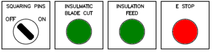
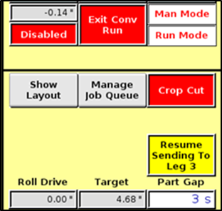

# Controls

TABLE OF CONTENTS

CONTROLS 1

A. Emergency Stop 1

B. Operator Control Console 1

C. Light Tower 2

D. COMPUTER CONTROLS 3

\(1\) Introduction 3

E. main Control pedestal 3

\(1\) POWER 4

\(2\) OL TRIP/E STOP 4

\(3\) E STOP 4

F. Product mounted Controls 4

\(1\) PRODUCT PAUSE 4

\(2\) E STOP 4

G. Drop-In Uncoiler WIRELESS PENDANT 5

\(1\) EMERGENCY STOP 6

\(2\) UNCOILER JOG _FWD and REV_ 6

\(3\) PRODUCTO JOG _FWD and REV_ 6

\(4\) COIL SELECT 6

\(5\) UNCOILER AUTO 6

H. ProDuct FEED TABLE CONTROL PANEL 6

\(1\) FEEDER JOG \(Forward/Reverse\) 6

\(2\) EMERGENCY STOP 6

\(3\) COIL SELECT JOG 7

\(4\) PINCH ROLL 7

\(5\) HOLD DOWN ROLL 7

I. MARK TRANSFER TABLE CONTROL PANEL \#1 7

\(1\) EMERGENCY STOP 7

\(2\) FEED INITIATE 8

\(3\) MARK PUSHER JOG REVERSE 8

\(4\) TDC/F PUSHER JOG REVERSE 8

J. TDC/F Duplex ROLLFORMER CONTROL PANEL 9

\(1\) EMERGENCY STOP 9

K. TDC/F control Pendant 10

\(1\) FIXED HEAD JOG IN 10

\(2\) FIXED HEAD JOG OUT 10

\(3\) ADJUSTABLE HEAD JOG IN 10

\(4\) ADJUSTABLE HEAD JOG OUT 10

\(5\) ROLLFORMER JOG 10

\(6\) PUSHER JOG REVERSE 10

L. INSULMATIC CONTROL PANEL 11

\(1\) LEAD \(LESS/ZERO/MORE\) 11

\(2\) TRAIL \(LESS/ZERO/MORE\) 11

\(3\) SQUARING PINS \(OFF/ON\) 11

\(4\) INSULMATIC BLADE CUT 11

\(5\) INSULATION FEED 12

\(6\) EMERGENCY STOP 12

M. Wrap Brake Control Panel 12

\(1\) BRAKE MANUAL 12

\(2\) BRAKE AUTO 13

\(3\) SINGLE CYCLE 13

\(4\) CARRIAGE JOG \(OUT/IN\) 13

\(5\) EMERGENCY STOP 13

N. COMPUTER CONTROLS 14

\(1\) Computer Screen Layout 14

\(2\) Alpha Pad 15

\(3\) Number Pad 15

\(4\) Main Screen 16

\(5\) Manage Job Queue 33

\(6\) Manual Screen 34

\(7\) Manual Line Screen 42

\(8\) Setup Screen 58

\(9\) Line Configuration Setup 60

\(10\) Drop-in Uncoiler Setup 64

\(11\) ProDucto Setup 66

\(12\) Full Events Setup 71

\(13\) Duct Lock Setup 72

\(14\) Mark Setup 73

\(15\) TDC/F Setup 75

\(16\) Inline Plasma Setup 77

\(17\) Insulmatic Setup 80

\(18\) Pin Spotter Setup 83

\(19\) Wrap Brake Setup 86

**LIST OF FIGURES**

Figure 1 - Operator Control Pedestal 2

Figure 2 - Light Tower 2

Figure 3 - Console Control Buttons and Switches 3

Figure 4 - Controls Located at the ProDuct Entrance 4

Figure 5 - Pendant Mounted on Control Pedestal 5

Figure 6 - Six Button Pendant in Docking Station 5

Figure 7 - Wireless Control Pendant 5

Figure 8 - Drop-In Uncoiler Mounted Controls 6

Figure 9 - Processor Feed Table Control Panel 7

Figure 10 - Mark Transfer Table Control Panel \#1 _Located on the Mark TT Conveyor \(outside\)_ 7

Figure 11 - Mark Transfer Table Control Panel \#2 _Located on the Mark TT \(Control side\)_ 8

Figure 14 - TDC/F Rollformer Control Panel E STOP 9

Figure 13 - TDC/F Control Pendant 10

Figure 14 - Insulmatic Mounted Control Panel 11

Figure 15 - Wrap Brake Control Panel 12

Figure 16 - Startup Screen 14

Figure 17 - Touch Screen Alpha Pad 15

Figure 18 - Number Pad 15

Figure 19 - MAIN Screen 16

Figure 20 - Job Line Fields 17

Figure 21 - Diamond Layout 21

Figure 22 - Tie Rod Rows 21

Figure 23 - Coil/Ga 22

Figure 24 - Current Jobs 22

Figure 25 - Screen Navigation Menu — Main Screen 23

Figure 26 - Information Fields 24

Figure 27 - Main Screen Activation Buttons 25

Figure 28 - Display Fields 32

Figure 29 - Manage Job Queue 33

Figure 30 - Manual Screen 34

Figure 31 - Brake Position 36

Figure 32 - Manual Line Screen 42

Figure 33 - Setup Screen 58

Figure 34 - Line Configuration Setup 60

Figure 35 - Default Job Settings 61

Figure 36 - Coil Configuration 62

Figure 37 - ProDucto Options 63

Figure 38 - Drop-in Uncoiler Setup 64

Figure 39 - ProDucto Setup 66

Figure 40 - Events Setup 71

Figure 41 - Duct Lock Setup 72

Figure 42 - Mark Setup 73

Figure 43 - TDC/F Setup 75

Figure 44 - Plasma Cutout Settings 77

Figure 45 - IP Control Panel 78

Figure 46 - Inline Plasma Touch Screen 78

Figure 47 - Insulmatic Setup 80

Figure 48 - Pin Spotter Setup 83

Figure 49 - Pin Spotter Scaling 85

Figure 50 - Wrap Brake Setup 86

## CONTROLS

The operator control console together with the computer touch screen provides a centralized location for the operator to direct the operations of the IOWA PRECISION PRODUCTOMATIC and PRO-FABRIDUCT processing lines.

| _**Note**_ |
| :--- |
| _**A number of the features described in this chapter may not be included in your processing line.**_ _The configuration of the control switches and control system depend on the application specified when the equipment was manufactured._ |

All operators should be familiar with the contents of this section, and have a thorough understanding of the procedures and operating principals covered.

Once the preparation set-up has been completed, the System Control Console is used for system operation and the production run.

### Emergency Stop

The **EMERGENCY STOP** \(**E. STOP**\) push/pull buttons are located around the line and are placed to be within practical reach should an emergency situation occur requiring the immediate shut-down of the system. Some E Stop buttons are lighted.

When the button is pulled or twisted-out the system is functional. When the button is pressed in, it stays in that position, immediately activating all system brakes and stopping all motors in the line. The emergency button\(s\) must be in the _pulled-out_ position for the system to operate. When an emergency button has been activated, the OL TRIP/E STOP lamp on the System Control Console will be illuminate.

| _**Note**_ |
| :--- |
| _All Emergency Stop Buttons must be in the pulled or twisted-out \(deactivated\) position for system operation._ |

### Operator Control Console

The System Control Console is used to select the production run computer program, input the program operational parameters and to engage and control the overall system during the production run. It consists of the system computer, touch screen displays along with the various mechanical buttons, switches and indicator lamps required for overall system control and condition warning.

Figure 1 - Operator Control Pedestal

Power is applied to the computer and operating system by pulling out on the System Control Pedestal POWER push/pull button. See _Figure 3_. The computer system will perform a system self-test, perform its boot-up procedure, then display the Main Program Screen on the monitor.

### Light Tower

Located on the pedestal is a light tower that is an indicator of active or impending machine functions. This light tower consists of an Amber light, Blue light, and warning horn.

Figure 2 - Light Tower

* **Warning Horn** – The warning horn indicates when the feed initiate button is pressed and held for three seconds, when starting from a batch inactive mode ONLY.
* **Blue Light** – When the blue light is activated \(turned on\), this indicates the processor is in a Batch Active mode. The light will continue to flash as long as the line is batch active.
* **Amber Light** – When the amber light is activated \(turned on\), this indicates that any servo drive motor is enabled \(turned on\). The light will continue to flash as long as the drive motor is still enabled \(turned on\).

### COMPUTER CONTROLS

#### Introduction

A touch screen display eliminates the need for a mouse or keypad. All touch screen functions are activated with the touch of a finger.

The PC may be used as a spare temporarily.

_**Computer Touch Screen Usage**_

Touch the desired field or menu to activate it.

* **Scroll Bars:** Within the computer control program, fields with much information or many choices displayed are equipped with a Scroll Bar.
* **Quantity Fields:** Touch the quantity field to activate it. A numerical keypad will appear allowing the value to be entered.
* **Pull Down Field:** Touch the down arrow to activate a pull down field. A menu of options will appear. Chose and touch the value to change and accept the function. Touch the down again to close the menu without any changes.

### main Control pedestal

The System Control Console Switch Panel contains the various mechanical buttons and switches and indicator lamps required for overall system control and condition warning.

Power

E Stop

Operator  
E Stop

Figure 3 - Console Control Buttons and Switches

HMI

\(Guru stick located under the screen. Lift lid to access.\)

Laptop power and network port

#### POWER

A _**red**_ lighted push/pull button located on the operator console. When pulled out, the light will _illuminate_ red with 110 VAC power applied to the computer control system. The remaining controls will remain disabled in the emergency stop condition \[_referenced as an_ **E STOP**\] until an **E STOP** reset can be performed by the operator.

| _**Note**_ |
| :--- |
| _To do an_ _**E STOP**_ _reset it is necessary to pull out on the_ _**POWER**_ _button again even though the power light is already illuminated. \(The_ _**POWER**_ _button is dual function for turning the control system on or off and resetting an emergency stop condition\)._ |

#### OL TRIP/E STOP

A _**red**_ indicator lamp located on the operator console. When this lamp is _illuminated_ it indicates that an overload condition on a motor may exist _or_ someone has initiated an _emergency stop_ from one of the **E STOP** buttons located around the equipment.

#### E STOP

Initiates an _emergency stop_ condition. A _**red**_ push/pull button that, when pushed in, initiates an _emergency stop_ condition. The **E STOP** button is located on the operator's console and in various locations around the equipment. When an E STOP button is activated, the red light on the **OL TRIP/E STOP** will _illuminate and_ all the system motors will stop.

To reset the _emergency stop_ condition, the **E STOP** button that was pushed in must be pulled back out, and the **POWER** push/pull button located on the control pedestal must be pulled out momentarily.

### Product mounted Controls

|  |  |
| :--- | :--- |

Figure 4 - Controls Located at the ProDuct Entrance

#### PRODUCT PAUSE

A push-button when pushed in pauses the ProDuct and illuminates.

#### E STOP

See description above.

### Drop-In Uncoiler WIRELESS PENDANT

The wireless control pendant is docked \(charged\) at the back of the control pedestal. The receiver is mounted on the operator side of the first drop-in uncoiler unit. See _Figure 5 & 5_.

|  |  |
| :--- | :--- |
| Figure 5 - Pendant Mounted on Control Pedestal | Figure 6 - Six Button Pendant in Docking Station |

|  | 1 | E STOP |
| :--- | :--- | :--- |
| 2 | Power Key Switch |  |
| 3 | Status LED Indicator |  |
| 4 | Uncoiler Jog REV |  |
| 5 | Uncoiler Jog FWD |  |
| 6 | ProDuct Jog REV |  |
| 7 | ProDuct Jog FWD |  |
| 8 | Uncoiler Auto |  |
| 9 | Coil Select |  |
| 10 | TAC\* and Inductive Charging Slot |  |
| 11 | Battery Cover Screw |  |
| 12 | Lanyard & Waist Belt Attachment Slot |  |

Figure 7 - Wireless Control Pendant

#### EMERGENCY STOP

An emergency stop condition is initiated. A push/pull button that, when pushed in, initiates an emergency stop condition. The red OL TRIP/E STOP light will also illuminate as all motors stop. To reset the emergency stop condition, the Emergency Stop button that was pushed in must be pulled back out and the POWER push/pull button must be pulled out momentarily.

#### UNCOILER JOG _FWD and REV_

Two jog push-buttons located on the wireless pendant. One button is used to jog the coil material _forward_ \(into\) and the other to jog the material in _reverse_ \(out of\) the uncoiler station number on the current selected _Job_ on the _Main Screen_.

#### PRODUCTO JOG _FWD and REV_

Two jog push-buttons located on the wireless pendant. These buttons are used when feeding \(jogging\) material into or out of the processor.

#### COIL SELECT

A push button located on the wireless pendant. \(Also see Main Screen _Coil/Ga,_ page _22_.\)

#### UNCOILER AUTO

A push-button located on both the wireless pendant and a push-button mounted on the operator side of the uncoiler that illuminates green when the _Uncoiler Auto_ is activated.

|  |  |
| :--- | :--- |

Figure 8 - Drop-In Uncoiler Mounted Controls

### ProDuct FEED TABLE CONTROL PANEL

#### FEEDER JOG \(Forward/Reverse\)

A remote jog control pendent located by the feed table of the ProDuct. The pendent is used to jog the coil material either forward _\(into\)_ or reverse _\(out of\)_ the processor. To utilize the jog pendent, the hydraulics and roll drive must be enabled.

#### EMERGENCY STOP

Initiates an emergency stop condition. A push/pull button that, when pushed in, initiates an emergency stop condition. The red **OL TRIP/E STOP** light will also illuminate as all motors stop. To reset the emergency stop condition, the Emergency Stop button that was pushed in must be pulled back out and the **POWER** push/pull button must be pulled out momentarily.

Figure 9 - Processor Feed Table Control Panel

#### COIL SELECT JOG

A **green** illuminated push-button. When depressed, the selected feed rolls will lower and drive the material up the feed chute into the feed table area. The rolls will jog in a forward direction only. Before utilizing this button, ensure the Uncoiler is in auto mode and the manual hydraulic shutoff is turn to the on position for the desired station.

#### PINCH ROLL

A two position, spring return to center, selector switch. This switch is used to raise and lower the ProDuct entry pinch roll. The hydraulics must be on to utilize this switch.

#### HOLD DOWN ROLL

A two position, spring return to center, selector switch. This switch is used to rotate the hold down roll clockwise or counter clockwise which located on the first station of the drop in uncoilers.

### MARK TRANSFER TABLE CONTROL PANEL \#1

Figure 10 - Mark Transfer Table Control Panel \#1  
_Located on the Mark TT Conveyor \(outside\)_

#### EMERGENCY STOP

Initiates an emergency stop condition. A push/pull button that, when pushed in, initiates an emergency stop condition. The red **OL TRIP/E STOP** light will also illuminate as all motors stop. To reset the emergency stop condition, the Emergency Stop button that was pushed in must be pulled back out and the **POWER** push/pull button must be pulled out momentarily.

#### FEED INITIATE

A green push-button used to process on part at a time when in batch active mode or start a new batch.

Figure 11 - Mark Transfer Table Control Panel \#2  
_Located on the Mark TT \(Control side\)_

#### MARK PUSHER JOG REVERSE

A **green** push button. This button is used to jog the Mark Transfer Table pushers in a reverse direction only.

#### TDC/F PUSHER JOG REVERSE

A **green** push button. This button is used to jog the TDC/F Transfer Table pushers in a reverse direction only.

### TDC/F Duplex ROLLFORMER CONTROL PANEL

#### EMERGENCY STOP

Initiates an emergency stop condition. A push/pull button that, when pushed in, initiates an emergency stop condition. The red **OL TRIP/E STOP** light on the pedestal will also illuminate as all motors stop. To reset the emergency stop condition, the Emergency Stop button that was pushed in must be pulled back out and the **POWER** push/pull button on the control pedestal must be pulled out momentarily.

Figure 12 - TDC/F Rollformer Control Panel E STOP

### TDC/F control Pendant

The TDC/F control pendent is located on the adjustable head of the TDC/F Rollformer. This pendent allows the operator to move both heads in or out and jog the pushers and rolls of the TDC/F Rollformer.

Figure 13 - TDC/F Control Pendant

#### FIXED HEAD JOG IN

This button is used to jog the fixed TDC/F Rollformer head inward. _The Rollformer Jog button must be held down to jog the head._

#### FIXED HEAD JOG OUT

This button is used to jog the fixed TDC/F Rollformer head outward. _The Rollformer Jog button must be held down to jog the head._

#### ADJUSTABLE HEAD JOG IN

This button is used to jog the adjustable TDC/F Rollformer head inward.

#### ADJUSTABLE HEAD JOG OUT

This button is used to jog the adjustable TDC/F Rollformer head outward.

#### ROLLFORMER JOG

This button is used to jog the TDC/F Rollformer rolls in a forward direction only.

#### PUSHER JOG REVERSE

This button is used to jog the TDC/F Rollformer pushers in the reverse direction only.

### INSULMATIC CONTROL PANEL

The switch that controls the squaring pins and the buttons that control the blade and insulation feed may only be used during manual mode.

<table>
  <thead>
    <tr>
      <th style="text-align:left">
        

          
        

        
<b>MORE</b>
        

        
<b>MORE</b>
        

        
<b>LESS</b>
        

        
<b>LEAD ZERO</b>
        

        
<b>TRAIL ZERO</b>
        

        
<b>LESS</b>
        

      </th>
      <th style="text-align:left">
        
      </th>
    </tr>
  </thead>
  <tbody></tbody>
</table>

Figure 14 - Insulmatic Mounted Control Panel

#### LEAD \(LESS/ZERO/MORE\)

Trim potentiometer used to start \(LEAD\) the application of insulation sooner \(MORE\) or to start the application of insulation later \(LESS\). To reset to zero, turn the dial to the far left, then turn the dial to the far right, then center to zero.

#### TRAIL \(LESS/ZERO/MORE\)

Trim potentiometer used to the application of insulation sooner \(MORE\) or to start the application of insulation later \(LESS\). To reset to zero, turn the dial to the far left, then turn the dial to the far right, then center to zero.

#### SQUARING PINS \(OFF/ON\)

A two-position selector switch used to turn **OFF** and **ON** the operation of the _**Squaring Pins**_. Normal operation of the Insulmatic unit has the Squaring Pins ON. Based on part length the computer program will turn the squaring pins on or off.

| WARNING |
| :--- |
| **Before using the Insulmatic Blade Cut or the Insulation Feed buttons, ensure the Insulmatic and Exit Conveyor are disabled.** |
|  |

#### INSULMATIC BLADE CUT

A green push button, which fires the insulation blade cutoff cylinder. This button is typically used after the leading edge of the insulation is fed using the Insulation Feed button to feed the insulation past the blade.

#### INSULATION FEED

A green push-button button, which lowers the feed roll onto the insulation to advance the leading edge past the Insulmatic blade.

| _**NOTICE**_ |
| :--- |
| While the button is pressed the belts will turn on as long as the button is held down. |
|  |

| WARNING |
| :--- |
| **Never, at any time, put hands or fingers near the blade.** |
|  |

#### EMERGENCY STOP

Initiates an emergency stop condition. A push/pull button that, when pushed in, initiates an emergency stop condition. The red **OL TRIP/E STOP** light on the control pedestal will also illuminate as all motors stop. To reset the emergency stop condition, the Emergency Stop button that was pushed in must be pulled back out and the **POWER** push/pull button on the control pedestal must be pulled out momentarily.

### Wrap Brake Control Panel

Figure 15 - Wrap Brake Control Panel

#### BRAKE MANUAL

The Brake Manual push button performs various functions depending upon the state of the equipment and control system.

* **Initial power up:** If the drive has not been homed or the drive has not been enabled, this button, when pressed, will enable the drive and turn on the brake hydraulics.

| **DANGER** |
| :--- |
| **Depending upon the location of the brake carriage after the last shutdown, the brake carriage will move to the home proximity switch on initial power up. Ensure ALL personnel are clear of the brake when the Brake Manual button is pushed.** |
|  |

* **Auto Mode:** If the brake is in auto, pressing this button will disable the carriage and shut off the brake hydraulics.
* **Brake off Mode:** If the brake is shut off, pressing this button will turn the brake hydraulics on and enable the carriage.

| **DANGER** |
| :--- |
| **Depending upon the location of the brake carriage after the last shutdown, the brake carriage will move to the home proximity switch on initial power up. Ensure ALL personnel are clear of the brake when the Brake Manual button is pushed.** |
|  |

When the brake is in manual mode, the carriage may be jogged and a single cycle can be initiated.

#### BRAKE AUTO

A push-button button that is illuminated **green** when pushed in. The button sets the BRAKE into the AUTO operating mode which enables the brake carriage drive, homes the carriage if needed and looks for a part. In this mode, the BRAKE carriage drive and bending sequence is enabled and is controlled by the computer control system.

#### SINGLE CYCLE

A single position selector switch used to single cycle the brake. When this switch is rotated to the right \(clockwise\), the clamp will lower and the leaf will raise and lower and the clamp will rise back to its home position. This switch is typically used to circulate warm oil throughout the hydraulic system after an extended down time.

#### CARRIAGE JOG \(OUT/IN\)

A two position, spring return to center, selector switch. This switch is used to jog the brake carriage OUT \(away from the brake beam\) and IN \(towards the brake beam\). To utilize this switch, the carriage must be enabled and homed.

#### EMERGENCY STOP

Initiates an emergency stop condition. A push/pull button that, when pushed in, initiates an emergency stop condition. The red **OL TRIP/E STOP** light located on the pedestal will also illuminate as all motors stop. To reset the emergency stop condition, the Emergency Stop button that was pushed in must be pulled back out and the **POWER** push/pull button on the control pedestal must be pulled out momentarily.

### COMPUTER CONTROLS

Together with the control console buttons and switches, the Computer Control System provides the means to coordinate the operations of the processing line. The computer touch screen displays the operation details through a series of screens.

Figure 16 - Startup Screen

#### Computer Screen Layout

| _**Note**_ |
| :--- |
| _The control system described in the following pages may include features that are not enabled. If your equipment is a basic starter line, not an expanded FABRIDUCT line, the operation will closely match the description presented. Also, there are several options described that may not be included as part of your equipment package. If you have questions concerning the operation of your equipment, contact the Mestek Machinery Service Department._ |

#### Alpha Pad

When an alphabetical/numerical value needs to be entered, a touch screen keypad is activated automatically.

Figure 17 - Touch Screen Alpha Pad

#### Number Pad

When a numerical value needs to be entered a touch screen numerical pad will appear.

Figure 18 - Number Pad

#### Main Screen

The Main Screen enables the operator to activate machine components, select part parameters and access other screens and features of the computer control system.

Figure 19 - MAIN Screen

**Help**

Help is a feature designed to help the operator become familiar with the screen text by activating the Help button and clicking on the desired text. Each time the help feature is required the Help button must be activated.

**Main Screen Job Line Fields**

A job line is selected by touching the Part number with the stylus. With the job line activated, the job number will highlight and an arrow \(\) will appear to the right of the job number. Only five \(5\) job lines are displayed at a time with a maximum of \(100\) jobs, to scroll through the jobs, use the scroll bar located below the job fields.

**General**

When a button is activated the button will change colors indicating a status change in the equipment.

* **Red**: The computer will not operate that device without operator request.
* **Yellow**: The computer is operating the machine and it is not ready to receive a part from upstream equipment.
* **Green**: The computer is operating the machine and it is ready to receive a part from upstream equipment.

Figure 20 - Job Line Fields

**QTY**

User input. The number of parts is entered in this field. The grey colored field displays the number of parts made in the batch. The gray box will reset if the same job is run or if any fields are changed for that part.

**Length 1-M**

User input. This is the length of the first leg out of the processor or the length of a blank if Blanks is selected in the Duct Type field.

The male lock leg is placed before the first leg on a U-Line configuration and the female lock leg length is placed before the first leg on a Z-Line configuration.

| _**Note**_ |
| :--- |
| _After a numerical value has been Entered, the keypad will stay activated until all numerical fields are entered, or until the cursor reaches a field that does not require a value to be entered._ |

**Length 2-F**

User input. This is the length of the second leg out of the processor. This field is not required for Blanks or 4-Sided duct.

**Duct Type**

This is the type of duct to be produced. To change this field, touch the screen to activate the pull down menu and select the desired duct type. The number of V notches that will be put in the part and the number of bends are determined from the duct type. The type could be **Blanks** when running cut lengths with no notches. The column can also read **4-Sided**, **L-Shape**, **U-Shape** or **Wrap**.

* **Blanks**

Makes parts with no notches or bends. The total length is the number entered in Length 1. _The minimum blank length allowed is 16.00 inches_.

* **4-Sided**

Four sided duct has a lead and trail notch but no V notches and will not be bent. Total part length is Length 1 plus lead and trail size and last leg adder if used.

* **L-Shape**

L shape duct is LENGTH 1 + LENGTH 2 + lead and trail edges. A V notch is punched LENGTH 1 and the brake will bend it to make a LENGTH 1 by LENGTH 2 part and last leg adder if used. The lead and trail punch is made to provide the lead and trail edges for the lock.

* **U-Shape**

U shape duct is LENGTH 1 + LENGTH 2 + LENGTH 1 lead and trail edges and last leg adder if used. A lead and trail notch is punched and a V notches are punched at \(LENGTH 1 and LENGTH 2\). The brake bends the part at these points.

* **Wrap**

Wrap duct is LENGTH 1 + LENGTH 2 + LENGTH 1 + LENGTH 2 + lead and trail edges and last leg adder if used. A V notch is put in at LENGTH 1, LENGTH 2 + LENGTH 1. The BRAKE then puts bends in the part at the points where the V notches were punched.

**Bead/Damp**

* * If your equipment is equipped with a powered bead roll, the operator will need to select whether or not bead will be used on the part. A _**Y**_ means that a bead is needed for the job and an _**N**_ means that no bead is needed. The computer will alert the operator if the last job and the current job have different bead entries.
  * This is for operator information only. An _**N**_ means that a cutout is not required. For a job that requires a cutout in the first leg of the duct blank _**FIRST**_ is selected. For a job that requires a cutout in the second leg of the duct blank _**SECOND**_ is selected.

**Connector**

This is the type of connector being used. To change the connector type, activate the drop down menu and select the desired type. The connector types are:

* **TDC/F**
* **S & D** \(cleat\)

**Cleat Roller**

In this field the operator selects which mode is to be used. The choices are:

* **NONE** \(No cleat\)
* **ODDS or EVENS** \(A formed cleat placed on first and third legs or second and forth legs\)
* **FULL** \(Continuous cleat\)

**Cleat Type**

In this field the operator selects which end\(s\) the cleat will be formed on, _**Right**_ \(Right end only\), _**Left**_ \(Left end only\) or _**Both**_ \(Both ends\).

**Lock**

This is the lock type being used. These are changed by activating the drop down menu and selecting the desired lock type. The lead and trail sizes are setup in the _**Duct Lock Setup**_ Screen _Figure 41_.

Due to mechanical limitations, the lead and trail lock sizes must be equal to or larger than the lead and trail die width. The computer program _will not allow_ lead and trail sizes smaller than the die width to be processed due to limitations of the shear/break combination.

Some examples of Lock Types that _may_ appear are listed below:

* **LrgPitt** \(Large Pittsburgh\)
* **SmlPitt** \(Small Pittsburgh\)
* **Snap** \(Snap Lock\)
* **Raw 1** \(Grease duct with corner seam\)
* **Raw 2** \(Grease duct with split seam\)
* **MM** \(Male/Male\) This selection is not recommended for a ProDuct with a shear/brake combination.
* **FF** \(Female/Female\) This selection is not recommended for a ProDuct with a shear/brake combination.

**Seal/Brake**

* * A _**Y**_ means that sealant is needed for the lock and an _**N**_ means that no sealant is needed. The computer will alert the operator if the last job and the current job have different sealant entries. The sealant manual valves are turned on and off on top of the Mark Rollformer.
  * This tells the computer if the BRAKE is to be used for this job. If _**N**_ is selected, the BRAKE will not bend the part, and parts can pass through the BRAKE. _This does not affect the male bend in the shear/brake_.

**Insulation**

This is the insulation thickness measured in inches. To change the insulation thickness, activate the drop down list and select the desired thickness. The choices are:

* **None**
* **0.5**
* **1.0**
* **1.5**
* **2.0**

A change in pin placement is made if a PINSPOTTER is included.

**Pins**

This is the **maximum** spacing for pin placement for the insulation pins. To change the pin location, activate the pull down menu and select the desired placement. The choices are:

* **0** No pins
* **6″:** Pins placed at most - every 6 inches.
* **7″:** Pins placed at most - every 7 inches.
* **8″:** Pins placed at most - every 8 inches.
* **9″:** Pins placed at most - every 9 inches.
* **10″:** Pins placed at most - every 10 inches.
* **11″:** Pins placed at most - every 11 inches.
* **12″:** Pins placed at most - every 12 inches.

_The field is used only if the line is equipped with a PINSPOTTER_.

**Tie Rod L1**

This value defines the location of holes punched in each of the 1st and 3rd legs depending upon duct type. The options are: **None**, Left, **Cnt** \(Center\), **L&C** \(Left and Center\), **R&C** \(Right and Center\), **L&R** \(Left and Right\), **ALL** or **Diamond**.

Figure 21 - Diamond Layout

**Tie Rod L2**

This value defines the location of holes punched in each of the 2nd and 4th legs depending upon duct type. The options are: **None**, Left, **Cnt** \(Center\), **L&C** \(Left and Center\), **R&C** \(Right and Center\), **L&R** \(Left and Right\), **ALL** or **Diamond**.

**TR Rows**

This value defines the number of rows of tie rods that will be placed in the first and third legs and second and forth legs, depending upon the type of duct being processed. If Diamond is selected, 3 rows will need to be selected. See illustration for details.

Figure 22 - Tie Rod Rows

**Hole Size**

The edge dies are designed to changes sizes by sliding the die assembly between two choices. The center die requires the operator mechanically changes the size. This field offers two choices, 5/16” and 7/16”. The computer automatically selects the correct offset value for the selected die.

**Coil/Ga**

Coil number. \(0–99\)

Figure 23 - Coil/Ga

Gauge. Values determined by the line configuration setup screen.

**Width**

Coil width. Decimal value.

**DwnLd \#**

Down load number. The value displayed in this field is the downloaded job number.

**Current Job\(s\)**

The first two numbers, from left to right are the range of jobs that will be made once the line is placed into batch active mode. The number inside the white box is the job number that will be made first.

Figure 24 - Current Jobs

**Menu Button**

Located in the bottom left corner of the Main Screen is the Menu button. Selecting this button will open the list of setup and diagnostic screens and various other functions.

To hide the menu, touch the Close button.

**Line Component Activation Buttons**

Located on the right side of the touch screen display are several activation buttons, which are used to turn on and off line components. These activation buttons are also used in referencing, initiating batches of parts, shutting down or turning off line components, setting gap timers, and other various functions.

|  WARNING |
| :--- |
| Do not turn the equipment on or attempt to operate the system until you have read and understood the Overview, Controls, and Operation sections of this manual. Improper operation of the equipment could result in damage to the equipment and/or personnel injury. |

Figure 25 - Screen Navigation Menu — Main Screen

**Display Units**

Selecting this drop down list will enable the operator to choose how the measurements are displayed, either Inches or Metric.

**Display Language**

Selecting the drop down list will enable the operator to choose which language the computer displays.

**Production Stats Screen**

The Status Information Screen allows the operator to view total production time, part status and total material usage by gauges. This screen will be discussed in detail later in this chapter.

**Insert Job Screen**

The Insert Job Screen is used to configure a job and then insert it into the Main Screen for processing. This screen will be discussed in detail later in this chapter.

**Diagnostic Screen**

The Diagnostic Screen allows the operator to see the various machine sequence states. This screen will be discussed in detail later in this chapter.

**Setup Screen**

The Setup Screen allows the operator to access various configuration screens. From these screens the operator can enter specific information for each line component. This screen will be discussed in detail later in this chapter.

**Manual Screen**

The Manual Screen allows the operator to activate various components of the line for setup and troubleshooting purposes only and see input and output states for test purposes. This screen will be discussed in detail later in this chapter.

| **CAUTION** |
| :--- |
| The Manual Screen must be used with extreme caution or death or serious injury may occur. |

**Main Screen**

The **MAIN** screen is the _primary display_ screen used by the operator. From the **MAIN** screen several screens are accessible by selecting the Menu button. Each of these screens is described in detail later in this section.

**Main Screen Information Fields**

The information field is located at the bottom of the Main Screen and is for operator information only. This field is where machine error messages and process status notes are displayed.

To clear an error message, touch the message to acknowledge. When the pop up keypad appears, touch the \(\) to acknowledge the error\(s\) and then use the \(\) to close. Make note of the errors for troubleshooting before clearing them.

Figure 26 - Information Fields

| _**NOTICE**_ |
| :--- |
| It is recommended that the error messages are acknowledged and cleared as they occur. |

**Line Component Activation Buttons**

Located on the right side of the touch screen display are several activation buttons, which are used to turn on and off line components. These activation buttons are also used in referencing, initiating batches of parts, shutting down or turning off line components, setting gap timers, and other various functions.

|  WARNING |
| :--- |
| Do not turn the equipment on or attempt to operate the system until you have read and understood the Overview, Controls, and Operation sections of this manual. Improper operation of the equipment could result in damage to the equipment and/or personnel injury. |

To activate \(turn on\) a line component or initiate an action, touch the desired button and within 3 seconds touch the pop-up **Confirm Action** button that appears next to the Help button in the upper right hand corner of the screen or the **Confirm Action** button next to the Menu button in the left lower corner of the screen.

Once the action is confirmed the activation button will turn **green or yellow** depending upon the status of the component. To shut down a line component, touch the components activation button and the button will return to **red**.

Figure 27 - Main Screen Activation Buttons

**ENABLE HYDRAULICS**

This button is used to turn on and off the processors hydraulic system. When the system is activated \(on\), the button illuminates green and illuminates red when deactivated \(turned off\).

To activate the hydraulics, touch the button and within the allotted time, touch the confirm action button. To deactivate the processor hydraulics, touch the enable hydraulics button.

| _**NOTICE**_ |
| :--- |
| **DO NOT** touch the Hydraulics button while batch active or a batch cancel will occur. |

**ENABLE ROLL DRIVE**

This button is used to turn on and off the processors servo drive system. When the drive is activated \(on\), the button illuminates green and illuminates red when deactivated \(turned off\).

To _activate_ the Roll Drive, touch the button and within the allotted time, touch the confirm action button. To deactivate the drive system, touch the enable roll drive button.

| _**NOTICE**_ |
| :--- |
| **DO NOT** touch the Enable Roll Drive button while batch active or a batch cancel will occur. |

**MANUAL MODE**

This button is used to return from Run mode to Manual mode. When the hydraulic system is enabled the processor will be in manual mode.

When the computer control system is in manual mode the button will be green. When the computer control is in batch auto or run mode this button will be red.

**FEED INITIATE**

This button is used to start a batch when in Run Mode and not batch active. To start the batch, press and hold the button for approximately 3 seconds.

This button is also used when batch active but not in batch auto. To feed 1 part, press the button momentarily.

|  WARNING |
| :--- |
| **Before activating** FEED INITIATE**, ensure ALL personnel are clear of the ProDuct line.** |

**BATCH AUTO**

Once the control is batch active, the following conditions apply to this button.

* With batch auto off, press the feed initiate button once for each part.
* With full batch auto off and batch auto on, press feed initiate to run all the parts in the job.
* With full batch auto on and batch auto on, press the feed initiate to run all the jobs setup up.

**-RUN MODE**

This button is used to place the processor into run mode. When the line is in run mode, the button illuminates green and illuminates red when in Manual mode or when the hydraulics is off. To process parts, this button must be activated. When in Run Mode most manual functions are disabled.

**BATCH INACTIVE / BATCH CANCEL**

This button displays the current status of the batch and is also used to cancel an active batch. When the line is inactive the button will be red and display Batch Inactive. When the line goes batch active, the button will turn green and display Batch Cancel.

To perform a _batch cancel_, touch this button and within the allotted time touch the Confirm Action button.

**UNCOILER AUTO**

This button is used to place the uncoilers into auto mode. When the uncoilers are in auto mode, the button illuminates green and illuminates red when in Manual mode.

Unless station \#1 is selected and the gauge is heavier or equal to the setting on uncoiler setup page, material will pay off until the selected slack bar is contacted by the material.

To _activate_ the Uncoilers Auto button while in Manual mode, just touch the Uncoiler Auto button. Material will now be paid off whenever the material comes off the slack bars.

**FORCE PART EJECT**

This field shows whether to force eject a part off the Mark Transfer Table or not. To perform a force eject, touch the button and within the allotted time touch the confirm action button. The button text will turn green and after the part is sheared to length, it will be transferred off the Mark Transfer Table and not pushed into the Mark Rollformer.

**MARK TT \(1\)**

This button is used to turn on the Mark Transfer Table. To activate the Mark Transfer Table, touch the button and within the allotted time touch the confirm action button. Once the confirm action button is touched, the pusher drive will start to _home_ the pushers and the button will turn yellow until the pushers are _homed_ the transfer rolls will turn on and the button will turn green.

To _deactivate/turn_ _off_ the Mark Transfer Table, touch the button.

|  WARNING |
| :--- |
| **Before activating this button, ensure ALL personnel are clear of the Mark Transfer Table.** |

**MARK RUN \(1\)**

This button is used to turn on the Mark Rollformer table. To activate the Mark, touch the button and within the allotted time touch the confirm action button. Once the confirm action button is touched the Mark Rollformer drive will turn on and the Mark head will raise or lower to the Lock position of the part that is selected on the Main Screen and the button will turn green.

This button cannot be turned on with a part present in the Rollformer. The drive can only be turned on with the manual button in the Manual Line screen.

To _deactivate/turn off_ the Mark Rollformer, touch the button.

|  **WARNING** |
| :--- |
| **Before activating this button, ensure ALL personnel are clear of the Mark Rollformer.** |

**TDC/F TT \(1\)**

This button is used to turn on the TDC/F Transfer Table. To activate the TDC/F Transfer Table, touch the button and within the allotted time touch the confirm action button. Once the confirm action button is touched, the pusher drive will start to “home” the pushers and the button will turn yellow until the pushers are “homed”. The transfer rolls will turn on and the button will turn green.

To deactivate/turn off the TDC/F Transfer Table, touch the button.

|  WARNING |
| :--- |
| **Before activating this button, ensure ALL personnel are clear of the TDC/F Transfer Table.** |

**TDC/F PUSHER \(1\)**

This button is used to turn on the TDC/F pushers. To activate the TDC/F pushers, touch the button and within the allotted time touch the confirm action button. Once the confirm action button is touched, the button will turn yellow and the pusher drive will start to _home_ the pushers and after the pushers are _homed_ the button will turn green.

To _deactivate/turn off_ the TDC/F pushers, touch the button.

|  WARNING |
| :--- |
| **Before activating this button, ensure ALL personnel are clear of the TDC/F Rollformer.** |

**TDC/F RUN \(1\)**

This button is used to turn on the TDC/F rollforming machine. To activate the TDC/F rollformer, touch the button and within the allotted time touch the confirm action button. Once the confirm action button is touched, the TDC/F drive will start to and the button will turn green.

To _deactivate/turn off_ the TDC/F Rollformer, touch the button.

|  **WARNING** |
| :--- |
| **Before activating this button, ensure ALL personnel are clear of the TDC/F Rollformer.** |

**INSULMATIC RUN \(1\)**

This button is used to activate the Insulmatic when liner is required. To activate the Insulmatic, touch the button and within the allotted time touch the confirm action button. Once the confirm action button is touched, the Insulmatic will be under computer control and the transfer belts will turn on and the button will turn green.

To _deactivate/turn off_ the _Insulmatic,_ touch the button.

|  WARNING |
| :--- |
| **Before activating this button, ensure ALL personnel are clear of the Insulmatic.** |

**ENABLE CARRIAGE**

This button is used to enable and disable the brake carriage. To enable the carriage, touch the button and within the allotted time touch the confirm action button. Once the carriage is enabled, the brake hydraulics will also turn on.

To deactivate/turn off the Brake carriage, touch the button. The brake hydraulics will also turn off.

**HOME CARRIAGE**

This button is used to manually home the brake carriage. When the brake carriage is _homed_, the brake carriage will move to the home proximity switch that is located at the entrance end of the brake and then move back off the switch. Any changes made to the reference position that was requested require a homing procedure before taking effect.

**BRAKE RUN \(1\)**

This button is used to turn on the Brake. To activate the Brake, touch the button and within the allotted time touch the confirm action button. Once the confirm action button is touched, the button will turn yellow and the brake hydraulics will turn on, the leaf and beam will return to their “home” positions, the belts will turn on and the brake carriage will be enabled and will move to its “home” position if needed and the button will turn green.

To deactivate/turn off the Brake, touch the button.

|  WARNING |
| :--- |
| **Before activating this button, ensure ALL personnel are clear of the Brake.** |

**DISABLED**

This button is used to enable and disable the brake. When the brake is enabled this button will be red and the part will be bent in the brake when **Y** selected on the on the current job. When the brake is disabled, the button will be green.

When the brake is disabled, regardless if **Y** is selected or not, the grippers will engage the part and transfer it to the end of the brake and release it without making any bends.

**EXIT CONVEYOR RUN**

This button is used to turn on the Exit Conveyor system. To activate the Exit Conveyor System, touch the button and within the allotted time touch the confirm action button. Once the confirm action button is touched, the Insulmatic and Brake transfer belts will turn on and the button will turn green.

The Exit Conveyor system will also turn on automatically when the brake or insulmatic are turned on.

To deactivate/turn off the Exit Conveyor System, touch the button.

|  WARNING |
| :--- |
| **Before activating this button, ensure ALL personnel are clear of the Insulmatic and Brake.** |

**MAN MODE**

This button is used to return from Run mode to Manual mode. When the hydraulic system is enabled the processor will be in manual mode.

When the computer control system is in manual mode the button will be green. When the computer control is in batch auto or run mode this button will be red.

**RUN MODE**

This button is used to place the processor into run mode. When the line is in run mode, the button illuminates green and illuminates red when in Manual mode or when the hydraulics are off. To process parts, this button must be activated. When in Run Mode most manual functions are disabled.

**SHOW LAYOUT**

This button is used to activate the Layout screen. When the Layout screen is activated this button will switch to Hide Layout. To hide the layout screen just touch this button.

**MANAGE JOB QUEUE**

This button is used to access the Job Queue screen. See _Manage Job Queue,_ page _33._

**CROP CUT**

This button is used to fire the shear. To fire the shear, touch the button and within the allotted time touch the confirm action button. The shear will then fire cutting the material. To use this button, the hydraulics must be on and not in Run Mode.

| _**NOTICE**_ |
| :--- |
| Before activating the _Crop Cut_, ensure the leading edge of the material extends past the shear head. |

**RESUME SENDING TO LEG 3**

**Display Fields**

There are two display fields located in the Activation Button fields.

**1**

**2**

Figure 28 - Display Fields

* 1. **Display only**. This is the location of the gripper arms in relationship to the brake point. As the grippers move towards the beam this number will get smaller and as the grippers move away from the beam this number will get larger.
  2. **Display only**. The value displayed in this field will depend upon which measuring device is being used.

When material is present in the feeder and the measure wheel is active, this value will display the amount of material that has passed under the measure wheel.

When material is not present in the feeder, the value displayed in this field will be populated by the measuring system used by the servo drive unit.

#### Manage Job Queue

Figure 29 - Manage Job Queue

_**Plasma Cutout Settings**_

#### Manual Screen

The Manual Screen is accessed from any screen by activating the Menu button in the lower left hand corner of the screen. This screen enables the operator to manually fire valves, machine processes, and view the status of proximity switches. Each button and field is described in detail in this section.

The Manual Line Screen button located in the lower left hand corner of the screen enables the operator to switch to the Manual Line Screen for additional manual operations.

Figure 30 - Manual Screen

**ENABLE ROLL DRIVE**

This button is used to turn on and off the processors servo drive system. When the drive is activated \(on\), the button illuminates green and illuminates red when deactivated \(turned off\).

To activate the Roll Drive, touch the button and within the allotted time, touch the confirm action button. To deactivate the drive system, touch the enable roll drive button.

**ROLL DRIVE JOG REVERSE**

This button is used to jog the ProDuct roll drive in reverse. Press the button to test momentarily or press and hold the button for 3 seconds to latch on the drive system. To unlatch the drive, press the button again. The roll drive must be enabled to use this button.

**ROLL DRIVE JOG FORWARD**

This button is used to jog the ProDuct roll drive forward. Press the button to test momentarily or press and hold the button for 3 seconds to latch on the drive system. To unlatch the drive, press the button again. The roll drive and hydraulics must be on to use this button. In addition, the beam must be up and the leaf must be down before the ProDuct can jog forward.

**HOME ROLL DRIVE**

This button is used to reset the Actual Position field to zero. This is not required for normal machine operation.

**ACTUAL POSITION**

The value displayed in this field will depend upon which measuring device is being used.

When material is present in the feeder and the measure wheel is active, this value will display the amount of material that has passed under the measure wheel.

When material is not present in the feeder, the value displayed in this field will be populated by the measuring system used by the servo drive unit.

**ENABLE CARRIAGE**

This button is used to enable and disable the brake carriage. To enable the carriage, touch the button and within the allotted time touch the confirm action button.

To deactivate/turn off the Brake carriage, touch the button.

**CARRIAGE JOG IN**

This button is used to jog the brake carriage in \(towards the break beam\). Press the button to test momentarily or press and hold the button for 3 seconds to latch on the drive system. To unlatch the drive, press the button again. To use this button, the carriage must be enabled.

**NEG LIMIT \(INPUT FIELD\)**

This field is typically used in troubleshooting. This field indicates the carriage is sensed at the end of the exit travel limit. The text will turn green when this limit has been reached.

**CARRIAGE JOG OUT**

This button is used to jog the brake carriage out \(away from the break beam\). Press the button to test momentarily or press and hold the button for 3 seconds to latch on. To unlatch, press the button again. To use this button the carriage must be enabled.

**POS LIMIT \(INPUT FIELD\)**

This field is typically used in troubleshooting. This field indicates the carriage is sensed at the end of the entrance travel limit. The text will turn green when this limit has been reached. This typically occurs when the carriage is being homed.

**HOME CARRIAGE**

This button is used to manually home the brake carriage. When the brake carriage is _homed_, the brake carriage will move to the home proximity switch that is located at the entrance end of the brake and then move back off the switch.

Any changes made to the reference position that was requested require a homing procedure before taking effect.

**BRAKE POSITION**

This is the location of the gripper arms in relationship to the brake point. As the grippers move towards the beam this number will get smaller and as the grippers move away from the beam this number will get bigger.

Figure 31 - Brake Position

**ENABLE HYDRAULICS**

This button is used to turn on and off the processors hydraulic system. When the system is activated \(on\), the button illuminates green and illuminates red when deactivated \(turned off\).

To activate the hydraulics, touch the button and within the allotted time, touch the confirm action button. To deactivate the processor hydraulics, touch the enable hydraulics button.

**UNCOILER AUTO**

This button is used to place the uncoilers into auto mode. When the uncoilers are in auto mode, the button illuminates green and illuminates red when in Manual mode.

Unless station \#1 is selected and the gauge is heavier or equal to the setting on uncoiler setup page, material will pay off until the selected slack bar is contacted by the material.

To activate the Uncoilers Auto button while in Manual mode, just touch the Uncoiler Auto button. Material will now be paid off whenever the material comes off the slack bars.

**SLACK BAR CONTACT \(**_**Input Field**_**\)**

When material is in contact with the slack bar the text will be red. When the material is not contacting the slack bar the text will turn green.

**VALVE ENABLE \(Display Only\)**

This field displays the current status of the hydraulic proportional valve that controls the acceleration and deceleration of the drop in uncoiler drive motor. When the text is red, the valve is turned off and green when the valve is turned on.

**UNCOILER GO REV**

This button is used to jog the selected uncoiler station reverse. Press the button to test momentarily. The hydraulics must be on to use this button.

**UNCOILER GO FWD**

This button is used to jog the selected uncoiler station forward. Press the button to test momentarily. The hydraulics must be on to use this button.

**MW IN USE \(Input Field\)**

This field displays the status of the measure wheel. When the material present at feeder proximity switch is de-activated the text will be red and will be green when material is activating the switch.

_**Coil Processor**_

**MATERIAL IS PRESENT \(Input Field\)**

This field displays whether or not material is present at the feeder. When the material present at feeder proximity switch is de-activated the text will be red and will be green when material is activating the switch. If this input field is green, the MW In Use input field should also be green.

**MATERIAL IS HUMPED \(Input Field\)**

This field displays whether or not material is humped between the feeder roll and the shear. When the switch is not activated the text will be red and will be green when the switch is activated.

**BEAM GO DOWN**

This button is used to lower the beam. Press the button to test momentarily or press and hold the button for 3 seconds to latch the beam in the down position. To unlatch, press the button again. To use this button the hydraulics must be on and the leaf must be down.

**IS DOWN \(Input Field\)**

This field displays the status of the beam. When the text is red the beam is in the up position and when the beam is down the text is green.

This button is used to raise the beam. Press the button to test momentarily or press and hold the button for 3 seconds to latch the beam in the up position. To unlatch, press the button again. The hydraulics must be on to use this button.

**BEAM GO UP**

This button is used to raise the beam. Press the button to test momentarily or press and hold the button for 3 seconds to latch the beam in the up position. To unlatch, press the button again. The hydraulics must be on to use this button.

**IS UP \(Input field\)**

This field displays the status of the beam. When the text is red the beam is in the down position and when the beam is up the text is green.

**V NOTCH**

This button is used to fire the V Notch Die. Press the button to test momentarily or press and hold the button for 3 seconds to latch. To unlatch, press the button again. The hydraulics must be on to use this button.

**L&T NOTCH**

This button is used to fire the Lead and Trail Notcher Die. Press the button to test momentarily or press and hold the button for 3 seconds to latch. To unlatch, press the button again. The hydraulics must be on to use this button.

**NOTCH SHUTTLE**

This button is used to turn on the notcher die shuttle cylinder. Press the button to test momentarily or press and hold the button for 3 seconds to latch. To unlatch, press the button again. The hydraulics must be on to use this button.

**PLENUM L&T NOTCH**

This button is used to fire the Plenum Lead and Trail Notcher Die. Press the button to test momentarily or press and hold the button for 3 seconds to latch. To unlatch, press the button again. The hydraulics must be on to use this button.

**CROP CUT**

This button is used to fire the shear. To fire the shear, touch the button and within the allotted time touch the confirm action button. The shear will then fire, cutting the material. To use this button the hydraulics must be on and not in Run Mode.

| _**NOTICE**_ |
| :--- |
| Before activating the CROP CUT, ensure the leading edge of the material extends past the shear head. |
|  |

**SHEAR FIRE**

This button is used to fire the shear for test purposes only. Press the button to test momentarily or press and hold the button for 3 seconds to latch. To unlatch, press the button again. To use this button the hydraulics must be activated and in Manual mode.

**LEFT TIE ROD DOWN**

This button is used to fire the Left Hand Tie Rod Notcher Die. Press the button to test momentarily or press and hold the button for 3 seconds to latch. To unlatch, press the button again. The hydraulics must be on to use this button.

**CENTER TIE ROD DOWN**

This button is used to fire the Center Tie Rod Notcher Die. Press the button to test momentarily or press and hold the button for 3 seconds to latch. To unlatch, press the button again. The hydraulics must be on to use this button.

**RIGHT TIE ROD DOWN**

This button is used to fire the Right Hand Tie Rod Notcher Die. Press the button to test momentarily or press and hold the button for 3 seconds to latch. To unlatch, press the button again. The hydraulics must be on to use this button.

**RUN BEND PROCESS \(**_**Coil Processor**_**\)**

The bend process is as follows: The beam lowers, the leaf raises and then lowers and the beam rises.

To cycle the bending process, touch the button and within the allotted time touch the confirm action button. When this button is activated, the bending sequence starts. To use this button, the hydraulics must be activated and in Manual mode.

**BEAM LEAF SWING DOWN**

This button is used to lower the beam leaf. Press the button to test momentarily or press and hold the button for 3 seconds to latch the beam leaf in the down position. To unlatch, press the button again. The hydraulics must be on to use this button.

**IS DOWN \(**_**Input Field**_**\)**

This field is typically used in troubleshooting. This field displays the status of the beam leaf. When the text is red the beam leaf is in the up position and when the beam leaf is down the text is green.

**BEAM LEAF SWING UP**

This button is used to raise the beam leaf. Press the button to test momentarily or press and hold the button for 3 seconds to latch the beam leaf in the up position. To unlatch, press the button again. To use this button the hydraulics must be on and the clamp down proximity switch must be on.

**IS UP \(**_**Input Field\)**_

This field is typically used in troubleshooting. This field displays the status of the beam leaf. When the text is red the beam leaf is in the down position and when the beam leaf is up the text is green.

**LEFT TIE ROD SHIFT**

This button is used to shuttle the left tie rod die. Press the button to test momentarily or press and hold the button for 3 seconds to latch. To unlatch, press the button again. The hydraulics must be on to use this button.

**CENTER TIE ROD SHIFT**

This button is used to shuttle the center tie rod die. Press the button to test momentarily or press and hold the button for 3 seconds to latch. To unlatch, press the button again. The hydraulics must be on to use this button.

**RIGHT TIE ROD SHIFT**

This button is used to shuttle the right tie rod die. Press the button to test momentarily or press and hold the button for 3 seconds to latch. To unlatch, press the button again. The hydraulics must be on to use this button.

**RUN SNAP LOCK PROCESS**

The snap lock process is as follows: The beam lowers, snap lock buttons engage and disengage and the beam rises.

To cycle the snap lock process, touch the button and within the allotted time touch the confirm action button. When this button is activated, the snap lock sequence starts. To use this button the hydraulics must be activated and the roll drive enabled.

**SNAP LOCK IN**

This button is used to engage the snap lock tooling. Press the button to test momentarily or press and hold the button for 3 seconds to latch. To unlatch, press the button again. The hydraulics must be on to use this button.

**EXTRACTOR REACH**

This button is used to extend the short part extractor arm. Press the button to test momentarily or press and hold the button for 3 seconds to latch. To unlatch, press the button again. The hydraulics must be on to use this button.

**BEAD ROLL GO DOWN**

This button is used to lower the bead roll if the powered bead roll was ordered. Press the button to test momentarily or press and hold the button for 3 seconds to latch. To unlatch, press the button again. The hydraulics must be on to use this button.

**LH CLEAT ENGAGE**

This button is used to fire the left hand cleat roller knock down cylinder. Press the button to test momentarily or press and hold the button for 3 seconds to latch. To unlatch, press the button again. The hydraulics must be on to use this button.

**RH CLEAT ENGAGE**

This button is used to fire the right hand cleat roller knock down cylinder. Press the button to test momentarily or press and hold the button for 3 seconds to latch. To unlatch, press the button again. The hydraulics must be on to use this button.

#### Manual Line Screen

The Manual Line Screen is accessed from the Manual Screen by activating the Manual Line Screen button in the lower left hand corner of the screen. This screen enables the operator to manually fire valves, machine processes, and view the status of inputs and outputs. Each button and field is described in detail in this section.

The Manual Screen button located in the lower left hand corner of the screen enables the operator to switch back to the Manual Screen.

Figure 32 - Manual Line Screen

_**Mark**_

**ENABLE HYDRAULICS**

This button is used to turn on and off the Mark hydraulics. When the system is activated \(on\), the button illuminates green and illuminates red when deactivated \(turned off\).

To activate the hydraulics, touch the button and within the allotted time, touch the confirm action button. To deactivate the Mark hydraulics, touch the enable hydraulics button.

**MARK TT \(8\)**

This button is used to turn on and off the Mark Transfer Table. When the table is activated \(on\), the button illuminates green and illuminates red when deactivated \(turned off\).

To activate the Mark Transfer Table, touch the button and within the allotted time, touch the confirm action button. To deactivate the Mark Transfer Table, touch the button again.

|  WARNING |
| :--- |
| **Before activating this button, ensure ALL personnel are clear of the Mark Transfer Table.** |
|  |

**MARK RUN \(8\)**

This button is used to turn on the Mark Rollformer table. To activate the Mark, touch the button and within the allotted time touch the confirm action button. Once the confirm action button is touched the Mark Rollformer drive will turn on and the Mark head will raise or lower to the Lock position of the part that is selected on the Main Screen and the button will turn green.

This button cannot be turned on with a part present in the Rollformer. The drive can only be turned on with the manual button in the Manual Line screen.

To deactivate/turn off the Mark Rollformer, touch the button.

|  WARNING |
| :--- |
| **Before activating this button, ensure ALL personnel are clear of the Mark Rollformer.** |
|  |

**Material at Transfer Table \(**_**Input Field**_**\)**

This field displays whether or not material is present at the Mark Transfer Table. When the text is red the proximity switch is not activated and when material activates the switch the text is green.

**MATERIAL AT ROLL FORMER \(**_**Input Field**_**\)**

This field displays whether or not material is present at the Mark Rollformer. When the text is red the proximity switch is not activated and when material activates the switch the text is green.

**CONVEYOR GO REV**

This button is used to jog the Mark Transfer Table conveyor transfer rolls reverse. Press the button to test momentarily or press and hold the button for 3 seconds to latch on. To unlatch, press the button again. The Mark Transfer Table must be off to use this button.

<table>
  <thead>
    <tr>
      <th style="text-align:left">
        <ul>
          <li>WARNING</li>
        </ul>
      </th>
    </tr>
  </thead>
  <tbody>
    <tr>
      <td style="text-align:left"><b>Before activating this button, ensure ALL personnel are clear of the Mark Transfer Table.</b>
      </td>
    </tr>
    <tr>
      <td style="text-align:left"></td>
    </tr>
  </tbody>
</table>

**CONVEYOR GO FWD**

This button is used to jog the Mark Transfer Table conveyor transfer rolls forward. Press the button to test momentarily or press and hold the button for 3 seconds to latch on. To unlatch, press the button again. The Mark Transfer Table must be off to use this button.

|  WARNING |
| :--- |
| **Before activating this button, ensure ALL personnel are clear of the Mark Transfer Table.** |
|  |

**GATE GO UP**

This button is used to raise the Mark Transfer Table pop up gate. Press the button to test momentarily or press and hold the button for 3 seconds to latch the gate in the up position. To unlatch, press the button again. The Mark Transfer Table must be off and air pressure is required.

|  WARNING |
| :--- |
| **Before activating this button, ensure ALL personnel are clear of the Mark Transfer Table.** |
|  |

**PUSHER GO REV**

This button is used to jog the Mark Conveyor pushers reverse. Press the button to test momentarily.

|  WARNING |
| :--- |
| **Before activating this button, ensure ALL personnel are clear of the Mark Transfer Table.** |
|  |

**PUSHER GO FWD**

This button is used to jog the Mark Conveyor pushers forward. Press the button to test momentarily.

|  WARNING |
| :--- |
| **Before activating this button, ensure ALL personnel are clear of the Mark Transfer Table.** |
|  |

**AT STOP** **\(**_**Input Field**_**\)**

This field displays whether or not the pushers have activated the home proximity switch. When the text is red the proximity switch is not activated and when pusher activates the switch the text is green.

**AT PAUSE \(**_**Input Field**_**\)**

This field displays whether or not the pushers have activated the pause proximity switch. When the text is red the proximity switch is not activated and when pusher activates the switch the text is green.

**FULL CYL GO DOWN**

This button is used to retract the Mark forming head cylinder. Press the button to test momentarily or press and hold the button for 3 seconds to latch. To unlatch, press the button again.

To use this button, the Mark hydraulics must be on and the Mark must be off.

Before the cylinder can be lowered, the Pass Cyl Go Down Is Down input field must be green.

**IS DOWN \(**_**Input Field**_**\)**

This field displays the status of the Mark Rollformer cylinder. When the text is red the cylinder is in the fully extended position and when the cylinder is fully retracted the text is green.

**FULL CYL GO UP**

This button is used to extend the Mark Forming Head cylinder. Press the button to test momentarily or press and hold the button for 3 seconds to latch. To unlatch, press the button again.

To use this button, the Mark hydraulics must be on and the Mark must be off.

**IS UP \(**_**Input Field**_**\)**

This field displays the status of the Mark Rollformer cylinder. When the text is red the cylinder is in the fully retracted position and when the cylinder is fully extended the text is green.

**ROLL FORMER DRIVE**

This button is used to jog the Mark Rollformer. To jog the Mark Rollformer, touch the button momentarily.

|  WARNING |
| :--- |
| **Before activating this button, ensure ALL personnel are clear of the Mark Rollformer.** |
|  |

**PASS CYL GO DOWN**

This button is used to retract the Mark Pass Through cylinder. Press the button to test momentarily or press and hold the button for 3 seconds to latch. To unlatch, press the button again.

To use this button, the Mark hydraulics must be on and Mark Rollformer must be off.

**IS DOWN \(**_**Input Field**_**\)**

This field displays the status of the Mark Pass Through cylinder. When the text is red the cylinder is in the fully extended position and when the cylinder is fully retracted the text is green.

**PASS CYL GO UP**

This button is used to extend the Mark Pass Through cylinder. Press the button to test momentarily or press and hold the button for 3 seconds to latch. To unlatch, press the button again.

To use this button, the Mark hydraulics must be on and Mark Rollformer must be off.

**IS UP \(**_**Input Field**_**\)**

This field displays the status of the Mark Pass Through cylinder. When the text is red the cylinder is in the fully retracted position and when the cylinder is fully extended the text is green.

**SEALANT ON**

This button is used to turn on and off the Cold Sealant system. When the cold sealant is activated \(on\), the button illuminates green and illuminates red when deactivated \(turned off\).

To use this button, the Mark Rollformer must be off and air pressure is on.

**TRVS HEAD JOG IN**

This button is used to jog the Mark traversing head inward. Press the button to test momentarily or press and hold the button for 3 seconds to latch. To unlatch, press the button again.

**AT HOME \(**_**Input Field**_**\)**

This field displays the status of the Mark traversing head. When the text is red the head is not activating the home proximity switch and when the home proximity switch is activated the text is green.

**TRVS HEAD JOG OUT**

This button is used to jog the Mark traversing head outward. Press the button to test momentarily or press and hold the button for 3 seconds to latch. To unlatch, press the button again.

**HOME TRVS HEAD**

This button is used to manually home the Mark traversing head. When the traversing head is “homed”, the head will move off the home proximity switch and then move back onto the switch. Once the switch is reactivated, the reference position will be loaded into the computer control.

**ACTUAL POSITION \(**_**Display Only**_**\)**

This field is typically used in troubleshooting. This field displays the position of the Mark Rollformer jog speed selector switch.

**ACTUAL POSITION \(**_**Display Only**_**\)**

This field displays the position of the Mark male head.

**HOME REF \(**_**Display Only**_**\)**

This field is typically used in troubleshooting. This field displays the current travel speed of the Mark traversing head.

**USING ADDER \(**_**Display Only**_**\)**

This field displays the current adder that is being used.

_**Coil Processor**_

**CROP CUT**

This button is used to manually perform a crop cut when needed.

_**TDC/F Transfer Table**_

**MATERIAL AT TRANSFER TABLE \(**_**Input Field**_**\)**

This field displays whether or not material is present at the TDC/F Transfer Table. When the text is red the proximity switch is not activated and when material activates the switch the text is green.

**AT STOP \(**_**Input Field**_**\)**

This field displays whether or not the pushers have activated the home proximity switch. When the text is red the proximity switch is not activated and when pusher activates the switch the text is green.

**PUSHER GO REV**

This button is used to jog the TDC/F Transfer Table pushers reverse. Press the button to test momentarily or press and hold the button for 3 seconds to latch on. To unlatch, press the button again.

|  WARNING |
| :--- |
| **Before activating this button, ensure ALL personnel are clear of the Mark Transfer Table.** |
|  |

**PUSHER GO FWD**

This button is used to jog the TDC/F Transfer Table pushers forward. Press the button to test momentarily or press and hold the button for 3 seconds to latch on. To unlatch, press the button again.

|  WARNING |
| :--- |
| **Before activating this button, ensure ALL personnel are clear of the Mark Transfer Table.** |
|  |

**CONVEYOR GO FWD**

This button is used to jog the TDC/F Transfer Table transfer rolls forward. Press the button to test momentarily or press and hold the button for 3 seconds to latch on. To unlatch, press the button again.

The TDC/F must be off to use this button.

|  WARNING |
| :--- |
| **Before activating this button, ensure ALL personnel are clear of the Mark Transfer Table.** |
|  |

**TDC/F TT \(8\)**

This button is used to turn on and off the TDC/F Transfer Table. When the table is activated \(on and ready\), the button illuminates green and illuminates red when deactivated \(turned off\).

When the button illuminates **Yellow** the transfer table is paused while other equipment is staging for process.

_**Plasma Table**_

**PUSHER BEING HELD \(**_**Display Only**_**\)**

Monitored by the program this tells when the Pushers are being held. Green = Being Held. Red = Not Held.

**MATERIAL AT ENTRANCE \(**_**Input Field**_**\)**

This field displays whether or not material is present at the entrance of the Plasma Table. When the text is red the proximity switch is not activated and when material activates the switch the text is green.

**PLASMA RUN \(8\)**

This indicates when the plasma is turned on and ready. Green = On and ready.  
Red = off.

When the button illuminates **Yellow** the plasma table is paused while other equipment is staging for process.

|  WARNING |
| :--- |
| **Before activating this button, ensure the Plasma Table exhaust is turned on.** |
|  |

This button is used to activate the Plasma Table exhaust system on or off. When the button is red the exhaust is not running and turns green when the exhaust system is turned on and ready.

**CONVEYOR**

This button is used to turn on the Plasma Table conveyor rolls. Press the button to test momentarily or press and hold the button for 3 seconds to latch on. To unlatch, press the button again.

To use this button, the Plasma Table must be turned off.

|  WARNING |
| :--- |
| **Before activating this button, ensure ALL personnel are clear of the Plasma Table.** |
|  |

**PART HOLD DOWN**

This button is used to control the clamp lever on the edge guide that holds the part in place while the Plasma is in use and active. When red, it is disengaged, not clamping When green, it is engaged, holding the part in place.

**GANTRY EXTEND**

This button is used to control the air cylinders that extend and retract the gantry hooks. Its position is monitored by a magnetic proximity switch mounted on the cylinder.

**IS IN \(**_**Display Only**_**\)**

Gantry cylinders are Retracted or IN. When the text is red the proximity switch is not activated and when material activates the switch the text is green.

**IS OUT \(**_**Display Only**_**\)**

Gantry Cylinders are Extended or OUT. When the text is red the proximity switch is not activated and when material activates the switch the text is green.

**PART GANTRY HOOK**

This button controls the Hooks on the gantry cylinders. Up is not contacting the part. Down is ready to carry the part onto the Plasma table. Red is UP Green is Down.

**AT ENT \(**_**Display Only**_**\)**

This display monitors a proximity switch as to whether or not the Gantry is present at the Entrance of the Plasma Table. When the button illuminates Red the Gantry is not present and **not** activated. When the button illuminates Green the Gantry is present at Entrance and activated.

**HOME \(**_**Display Only**_**\)**

Monitored by the program this tells when the Pushers are being held.  
Green = Being Held. Red = Not Held.

**AT EXIT \(**_**Display Only**_**\)**

This field displays whether or not material is present at the exit end of the Plasma Table. When the text is red the proximity switch is not activated and when material activates the switch the text is green.

**CARRIAGE GO REVERSE**

This is a manual button that controls the Gantry carriage in Reverse.

**CARRIAGE GO FORWARD**

This is a manual button that button controls the Gantry carriage going Forward.

**Pusher Position \(**_**Display Only**_**\)**

Once the leading edge of the part activates the Plasma Table Reference proximity switch this field will be populated with the offset value that was entered in the Material Eye Ref field in the Line Configuration screen. As the part is pushed into the Plasma Table, this field will be updated with the real-time position of the leading edge of the part.

This field will reset after each part.

**MATERIAL AT EXIT \(**_**Display Only**_**\)**

Monitored by a proximity switch this display tells when material is present at the exit end of the Plasma Table. Material is present when the text is Green.

**HIGH SPEED \(**_**Display Only**_**\)**

Monitored by the program this tells when the Gantry is in high speed.  
Green = In High Speed. Red = Normal Speed.

_**TDC/F**_

**AT PUSHER ENTRANCE \(**_**Input Field**_**\)**

This field displays whether or not material is present at the entrance of the TDC/F Rollformer. When the text is red the proximity switch is not activated and when material activates the switch the text is green.

**AT STOP \(**_**Input Field**_**\)**

This field displays whether or not the TDC/F pushers have activated the home proximity switch. When the text is red the proximity switch is not activated and when pusher activates the switch the text is green.

**PUSHER GO REV**

This button is used to jog the TDC/F pushers reverse. Press the button to test momentarily.

|  WARNING |
| :--- |
| **Before activating this button, ensure ALL personnel are clear of the TDC/F Rollformer.** |
|  |

**PUSHER GO FWD**

This button is used to jog the TDC/F pushers forward. Press the button to test momentarily.

|  WARNING |
| :--- |
| **Before activating this button, ensure ALL personnel are clear of the TDC/F Rollformer.** |
|  |

**ROLL FORMER DRIVE**

This button is used to jog the TDC/F Rollformer drive. Press the button to test momentarily.

To use this button, the TDC/F Rollformer must be turned off.

|  WARNING |
| :--- |
| **Before activating this button, ensure ALL personnel are clear of the TDC/F Rollformer.** |
|  |

_**INSULATOR**_

**AT GLUE \(**_**Input Field**_**\)**

This field displays whether or not material is present at the glue application area. When the text is red the proximity switch is not activated and when material activates the switch the text is green.

**MATERIAL AT INSULATION \(**_**Input Field**_**\)**

This field displays whether or not material is detected by the part present insulation feed proximity switch. When the text is red the proximity switch is not activated and when material activates the switch the text is green.

**MATERIAL AT SQUARING PINS \(**_**Input Field**_**\)**

This field displays whether or not material is detected by the part present squaring pin proximity switch. When the text is red the proximity switch is not activated and when material activates the switch the text is green.

**APPLY GLUE**

This button is used to toggle on and off the Extruded Glue system. When the extruded glue system is activated \(on\), the button illuminates green and illuminates red when deactivated \(turned off\).

**BLADE EXTEND**

Display only. When the button is red the blade cylinder is retracted and when blade cylinder is extended the button is green.

**BLADE RETRACT**

Display only. When the button is red the blade cylinder is extended and when blade cylinder is retracted the button is green.

**FEED ROLL GO DOWN**

Display only. When the button is red the feed roll is in the up position and then the button is green the feed roll is lowered.

**ENTRANCE CONVEYOR GO SLOW**

Display only. When the button is red the conveyor is in high speed or off and the button is green when the conveyor is in low speed.

**MATERIAL IS PRESENT**

**ENTRANCE CONVEYOR GO FAST**

Display only. When the button is red the conveyor is in low speed or off and when the button is green the conveyor is in high speed.

**PRESS ROLL GO DOWN**

Display only. When the button is red the press roll is in the up position and when the button is green the press roll is lowered.

**EXIT CONVEYOR GO SLOW**

Display only. When the button is red the conveyor is in high speed or off and when the button is green the conveyor is in low speed.

**EXIT CONVEYOR GO FAST**

This button is used to put the insulator exit conveyor into high speed. When the button is red the conveyor is in low speed and when the button is green the conveyor is in high speed.

Press the button to test momentarily or press and hold the button for 3 seconds to latch on. To unlatch, press the button again.

**SQUARE PINS GO UP**

When the button is red the squaring pins are in the down position and the button is green when the output is turned on.

_**PIN SPOTTER**_

**MATERIAL AT PINS \(**_**Input Field**_**\)**

This field displays whether or not material is detected by the part present at pin spotter. When the text is red the proximity switch is not activated and when material activates the switch the text is green.

**ACTUAL POSITION \(**_**Display Only**_**\)**

This field displays the position of the pin spotter measure wheel.

_**WRAP BRAKE**_

**NEG LIMIT** **\(**_**Input Field**_**\)**

This field is typically used in troubleshooting. This field indicates the carriage is sensed at the end of the exit travel limit. The text will turn green when this limit has been reached.

**POS LIMIT \(**_**Input Field**_**\)**

This field is typically used in troubleshooting. This field indicates the carriage is sensed at the end of the entrance travel limit. The text will turn green when this limit has been reached. This typically occurs when the carriage is being homed.

**ENABLE CARRIAGE**

This button is used to manually home the brake carriage. When the brake carriage is _homed_, the brake carriage will move to the home proximity switch that is located at the entrance end of the brake and then move back off the switch.

Any changes made to the reference position that was requested, require a homing procedure before taking effect.

**EXIT CONVEYOR RUN**

This button is used to toggle on and off the Insulmatic and Brake conveyors. Press the button to toggle on or off.

|  WARNING |
| :--- |
| **Before activating this button, ensure ALL personnel are clear of the Insulmatic and Brake.** |
|  |

**MATERIAL IS PRESENT \(**_**Input Field**_**\)**

This field displays whether or not material is detected by the part present brake carriage. When the text is red the proximity switch is not activated and when material activates the switch the text is green.

**MATERIAL AT SQUARING PINS \(**_**Input Field**_**\)**

This field displays whether or not material is detected by the part in clamp and square. When the text is red the part clamps are not activated and when material activates clamps the text is green.

**BRAKE LEAF SWING DOWN**

This button is used to lower the brake leaf. When the button is red the squaring pins are in the up position and the button is green when the brake leaf is down.

To use this button, the carriage drive must be enabled, brake turned off and the beam down.

Press the button to test momentarily or press and hold the button for 3 seconds to latch on. To unlatch, press the button again.

<table>
  <thead>
    <tr>
      <th style="text-align:left">
        <ul>
          <li>WARNING</li>
        </ul>
      </th>
    </tr>
  </thead>
  <tbody>
    <tr>
      <td style="text-align:left"><b>Before activating this button, ensure ALL personnel are clear of the Brake.</b>
      </td>
    </tr>
    <tr>
      <td style="text-align:left"></td>
    </tr>
  </tbody>
</table>

**IS DOWN \(**_**Input Field**_**\)**

This field displays the status of the Brake Leaf down proximity switch. When the text is red the leaf is not activating the proximity switch and when the leaf is detected the text is green.

**BRAKE LEAF SWING UP**

This button is used to raise the brake leaf.

To use this button, the carriage drive must be enabled, brake turned off and the beam down.

Press the button to test momentarily or press and hold the button for 3 seconds to latch on. To unlatch, press the button again.

|  WARNING |
| :--- |
| **Before activating this button, ensure ALL personnel are clear of the Brake.** |
|  |

**CLAMP GRIP**

This button is used to close the carriage gripper clamps. To use this button, the brake drive must be enabled.

Press the button to test momentarily or press and hold the button for 3 seconds to latch on. To unlatch, press the button again.

**DOWN INHIBITED \(**_**Input Field**_**\)**

This field displays the status of the beam close inhibit proximity switch. When the text is red the proximity switch is not activated and when the proximity switch is detected the text is green.

**DOWN INHIBIT \(**_**Input Field**_**\)**

This field displays the status of the arm lower inhibit proximity switch. When the text is red the proximity switch is not activated and when the proximity switch is detected the text is green.

**BEAM GO DOWN**

This button is used to lower the brake beam. When the button is red the beam is in the up position and the button is green when the beam is down.

To use this button, the carriage drive must be enabled, the leaf down and the carriage on activating the down inhibit proximity switch.

Press the button to test momentarily or press and hold the button for 3 seconds to latch on. To unlatch, press the button again.

|  WARNING |
| :--- |
| **Before activating this button, ensure ALL personnel are clear of the Brake.** |
|  |

**IS DOWN \(**_**Input Field**_**\)**

This field displays the status of the Brake Beam down proximity switch. When the text is red the beam is not activating the proximity switch and when the beam is detected the text is green.

**BEAM GO UP**

This button is used to raise the brake beam. When the button is red the beam is in the down position and the button is green when the beam is up. To use this button, the carriage drive must be enabled.

Press the button to test momentarily or press and hold the button for 3 seconds to latch on. To unlatch, press the button again.

|  WARNING |
| :--- |
| **Before activating this button, ensure ALL personnel are clear of the Brake.** |
|  |

**IS UP \(**_**Input Field**_**\)**

This field displays the status of the Brake Beam up proximity switch. When the text is red the beam is not activating the proximity switch and when the beam is detected the text is green.

**ARMS GO UP**

This button is used to raise the brake carriage arms. When the button is red the carriage arms are in the down position and the button is green when the carriage arms are up. To use this button the carriage drive must be enabled.

Press the button to test momentarily or press and hold the button for 3 seconds to latch on. To unlatch, press the button again.

|  WARNING |
| :--- |
| **Before activating this button, ensure ALL personnel are clear of the Brake.** |
|  |

**IS UP \(**_**Input Field**_**\)**

This field displays the status of the Brake carriage arm up proximity switch. When the text is red the beam is not activating the proximity switch and when the beam is detected the text is green.

**CONVEYOR GO SLOW**

Display only. When the button is red the conveyor is in high speed or off and when the button is green the conveyor is in low speed.

**CONVEYOR GO FAST**

Display only. When the button is red the conveyor is in high speed or off and when the button is green the conveyor is in low speed.

**ARMS GO DOWN**

This button is used to lower the brake carriage arms. When the button is red the carriage arms are in the up position and the button is green when the carriage arms are down.

To use this button, the carriage drive must be enabled and the carriage not activating the arm inhibit proximity switch.

Press the button to test momentarily or press and hold the button for 3 seconds to latch on. To unlatch, press the button again.

|  WARNING |
| :--- |
| **Before activating this button, ensure ALL personnel are clear of the Brake.** |
|  |

#### Setup Screen

The Setup Screen is accessed by activating the Menu button in the lower left hand corner of the screen. This screen enables the operator to setup machine parameters along with various other settings. Each button and field is described in detail in this section.

Figure 33 - Setup Screen

**Display Units**

This drop down list enables the operator to select which unit of measure \(Inches or Metric\) will be displayed in applicable fields.

**Display Language**

This drop down list enables the operator to select which language will be displayed on the screens.

**Timeout Time**

This field enables the operator to select the maximum amount of time \(measured in seconds\) that any process or operation can be held on before timing out and stopping the action. Keep this value high \(&gt; 60 seconds\) to allow values on the Diagnostic Screen to be viewed.

**Screen Saver**

This field enables the operator to setup how long the computer touch screen can sit idle before it goes into sleep mode. To activate the screen in screen saver mode, just touch the screen anywhere on the touch screen panel.

**Enable Zero Crop**

This button enables a crop cut be performed manually when needed.

**Dry Run**

This button is used to enable the dry run mode of operation. Please see the operations section of this manual for details on this mode.

**Re Run**

This button is used to enable the line to be placed into Re Run mode. Please see the operations section of this manual for details on this mode.

**Enable Full Batch Auto**

This button is used to enable the full batch auto mode of operation. This button enables the operator to run batch to batch **without** a feed initiate being pushed. Contact the Mestek Machinery service department if you have _any_ questions regarding the use of this button.

_When troubleshooting, this is the first thing to turn off._

**Save Sets**

Allows \(6\) alternative groups of equipment parameter settings to be defined and stored. These sets are useful for different groups of settings best suited for certain materials or gauges, that can be chosen as alternatives when need arises. Please see the operations section of this manual for details on this mode.

**Authorization Code**

This entry is used to give final authorization for operation of the equipment. This area will remain blank until the final authorization number is entered by the set up technician or the end user after all contract obligations have satisfied.

If this entry is not entered by a certain time period from the shipment date, the controls will cease to operate. This time period can be 30, 60, or 90 days, depending on the type of equipment. Contact the Mestek Service Department at 319-364-9181 for any questions on this code entry.

**Date / Time**

These fields are used to set the date and time of day. When a field is touched a keypad will appear for data entry.

**Networking Fields**

These fields are only to be used by authorized employees or Mestek Machinery personnel. Altering any of these fields may render your networking inoperable. Contact the Mestek Service Department at 319.364.9181 for assistance.

#### Line Configuration Setup

The Line Configuration Setup page has several settings that were set at Mestek Machinery and should not be modified without first contacting the Mestek Machinery Service Department. Modifying the settings may void the warranty and render your equipment inoperable.

To return to the Setup Screen, touch the Setup Screen button in the lower right hand corner of the screen. The fields that may be modified are described in detail below.

Figure 34 - Line Configuration Setup

**Default Job Settings**

The Default Job Settings fields enable the operator to enter defaults for each job that is displayed on the main screen before any modifications. IE, if job \# 55 has never been modified, the values and settings would mirror the settings made in this list of settings.

The default job settings fields save time when entering jobs by hand. IE, if snap lock is used 90% of the time, set the Lock field to snap. When a blank job is viewed on the Main Screen, Snap will appear in every blank job.

To reset all settings back to the factory settings, touch the _Reset All Jobs To Defaults_ button in the lower left hand corner of the screen. Descriptions for all _Default Job Settings_ begin on _page_ _17._

Figure 35 - Default Job Settings

* **Mark Type:** Choice of type
* **SA Cleat** Control: Stand Alone
* TDC Type:
* **Glue Type:** Extruded only
* Insulmatic Type: Swing Blade
* Pinspotter Type: Hi/Lo
* Servo Voltage: Line voltage

_The following are ON/OFF \(**green/red**\), buttons._

* Dual RF in Use
* Drop Crop
* Side Eject
* Force Part Eject
* Brake In Use
* Automatically Show Layout Layer

**Coil Configuration**

The following settings pertain to the gauge of material and coil station.

* * **Gauges:** The gauge material to be used in the station.
  * **Stations:** The uncoiler station to be used.

Figure 36 - Coil Configuration

**ProDucto Options**

Figure 37 - ProDucto Options

_The following are ON/OFF \(**green/red**\), buttons._

* Bead Roll Powered
* Tie Rod In Use
* Powered Ctr Tie Rod
* Shear In Use
* Powered Conn Shuttle
* Door Switch In Use
* Cleat Roller In Line
* Snaplock In Use
* Powered Edge Guides
* Brake In Use
* Hump Switch In Use
* Use EZ Hole Logic

#### Drop-in Uncoiler Setup

The Uncoiler Setup screen is used to setup drop-in uncoiler parameters.

Figure 38 - Drop-in Uncoiler Setup

**Uncoiler Settings**

The following settings pertain to the drop-in uncoilers.

* * **Max Long Move Processor** **Speed \(U/s\):** The value entered in this field is payout speed of the uncoilers, measured in units per second. DO NOT MODIFY this value or damage to the equipment will occur and the manufacturer warranty will be voided.
  * **Ramp Time:** The value entered in this field is the amount of time the uncoiler drive motor takes to decelerate to a stop after the material makes contact with the slack bars. This value was set at the manufacturer and should not require any modifications.
  * **Max Auto Payout Time:** The maximum amount of time the uncoiler will run in auto before seeing the slack bar. The program will display a message, _Uncoiler Runaway Detected. Auto Turned Off._ When the timer runs out. The operator can clear the message, correct the problem, and put it back into Auto.
  * **Disable Auto Backup After Last Part:** This button is used to enable and disable the auto backup feature. When the button is green, the auto back-up feature is disabled. When the button is red, the auto backup feature is enabled.

If this field is enabled, the ProDuct will back the material up after the last part of an active batch.

_Station 1 Settings_

* * **Invert Coil Gauges &gt;=:** The gauge value displayed in this field is the gauge of material that will be inverted, payed off the top, during processing. This value is typically set for heavy gauge coils only and over the top payoff is only available from station \#1. Do not attempt to use this feature without purchasing the appropriate options from the manufacturer.
  * **Disable/Enable Station 1 Auto:** This button is used to enable and disable the station \#1 auto feature. When the button is green, the coil in station \#1 will be fed from over the top.

_Speed Control Settings_

Set at maximum pressure at the Mestek factory.

* * **First Coil Speed %**
  * **Last Coil Speed %**
  * **Number of Coils in Use**

#### ProDucto Setup

The _ProDuct Setup_ screen is used to setup ProDuct parameters.

Figure 39 - ProDucto Setup

**ProDuct Settings**

The following settings pertain to the ProDuct.

* * **Offset:** The value entered in this field is the distance from the shear point, which has an offset of 0.000, to the center of a component. A die offset is measured to the center of the die.

The brake and snaplock offsets are negative values due to being in front of the shear. The brake offset is used to establish how much material is being bent and the snaplock offset is used to position the button punches on the male leg.

The Cleat Roller and Bead offsets are positive values. The value entered in these fields is the distance from the shear point \(0.000\) to the point of contact from the cleatroller knock down roll and the upper bead roll respectively.

* * **Adjustment Off:** This field allows the operator to make a positive or negative change to the offset being adjusted. When the field is touched, a keypad will appear. Enter the amount of adjustment, either a positive or negative value, on the keypad. When the enter key is pushed, the offset will be changed by the entered amount.
  * **Dwell:** This field is the amount of time, measured in milliseconds, the valve is turned on to complete the action.
  * **TDC/F Notch Adder:** The value entered in this field is the amount of extra material that will be removed with the lead and trail notchers. This material is removed from the female end of the notch. The overall length of the duct dimension will remain unchanged.
  * **S&D Notch Adder:** The value entered in this field is the extra material that is cut from the female end with the standard lead or trail notch. The main reason for the extra-long notch is to prevent the drive cleat to clear the Mark female forming rolls when a cleat is formed in the ProDuct cleat roller. The overall length of the duct dimension will remain unchanged.
  * **Crop Distance:** The value entered in this field is the distance used by the computer program when the auto backup feature is enabled.
  * **L & T Die Width:** The number entered is the physical die punch width dimension. The computer uses this parameter to make the correct number of punches of the L&T.
  * **Cleat Sub Distance:** This parameter value is used to adjust the distance the knockdown roll is down when forming a drive cleat. The value entered is subtracted the leg length that is going to be cleat formed.

IE, if a 6.00 leg is going to be formed and a value of 0.50 is entered in the Cleat Subtract field, the knock down roll will come up after 5.50. This allows the roll to correctly come down and up on the leg with the drive and not affect the previous or trailing legs of the duct.

* * **Knock Down On Delay:** This time delay, in milliseconds, the control delays the knock down roll to come down for the best position to start the forming of the cleat edge. This function is used with the Cleat Roller offset number for the best result. This feature is used with stand-alone cleatroller.
  * **Knock Down Off Delay:** This time delay, in milliseconds, the control delays the knock down roll to come back up for the best position to stop the forming of the cleat edge. This function is used with the Cleat Roller offset number for the best result. This feature is used with stand-alone cleatroller.
  * **Extractor Length:** This is the length of the longest part that the short part extractor will be extended to assist in pulling the part onto the transfer table from the shear.
  * **Distance To Gate:** The physical distance from the shear cut point to the Mark transfer table pop up gate. The computer uses this length to know how much material can be fed out while the gate is still raised.
  * **Extractor Dwell:** Time the extractor valve is turned on to extend and extract \(grab\) the short part from the shear.
  * **Bead Skip Gap Distance:** This is the distance the bead roll skips beading from certain areas of duct when beading is called for. This parameter is used to prevent beading the areas of the bends and the corner locks of the duct. This should be adjusted for the desired effect. The powered bead roll option is required for this field to be utilized.
  * **Maximum Move &gt; Uncoiler Speed:** The ProDuct feed control uses this parameter to determine the maximum move distance before the ProDuct feeder speed is reduced to equal uncoiler speed.

The reason for this parameter is to allow the ProDuct to move more quickly on short moves usually made during the duct making process. It also helps prevent pulling the metal tight on long moves normally seen when running long blanks.

* * **Maximum Move Error:** The amount of error allowed before corrections are made to target. Increasing this value may allow for quicker targeting, with resulting loss of accuracy. Decreasing this value may cause delayed targeting, with resulting increase in accuracy.
  * **Last Leg Adjuster:** This field is used to increase the length of the last leg of the duct out of the ProDuct.
  * **EZ Hole Distance From Lead:** This parameter value is used to adjust the distance the EZ hole is placed from the lead and trail notch on the lead end of the notch.
  * **EZ Hole Distance From Trail:** This parameter value is used to adjust the distance the EZ hole is placed from the lead and trail notch on the trail end of the notch.
  * **Tie Rod Shift Dwell:** The time, measured in milliseconds, the valve is turned on to shift the tie rods in or out. This is an optional feature.
  * **Notch Shuttle Dwell:** The time, measured in milliseconds, the valve is turned on to shift the notcher dies in or out. This is an optional feature.
  * **Edge Guide Pulse Time: \(Option\)** This parameter is factory set and must not be changed without authorization from Mestek Machinery service department.
  * **Notch Motor Pulse Time: \(Option\)** This parameter is factory set and must not be changed without authorization from Mestek Machinery service department.
  * **Center Motor Pulse Time: \(Option\)** This parameter is factory set and must not be changed without authorization from Mestek Machinery service department.
  * **Edge Guide Reference:** When the powered auto guide set up option is purchased; this is the position count loaded into the encoder position when the adjustable side entry guide is referenced to the home sensor position.
  * **Notch Position Reference:** When the powered auto notcher set up option is purchased; this is the position count loaded into the encoder position when the notcher die assembly is referenced to the home sensor position.
  * **Center Position Reference:** When the powered auto center tie rod option is purchased, this is the position count loaded into the encoder position when the center rod assembly is referenced to the home sensor position.
  * **Scrap Cut Minimum Distance:** The value \(measured in inches\) is the shortest amount of scrap possible with an up cut shear. Do not modify this value as a short scrap cut may get caught in the shear/brake and possibly damage the equipment.
  * **Short Brake Time:** This dwell timer, measured in milliseconds, is used when braking corners in Starter Line with a shear/brake.
  * **Long Brake Time:** This dwell timer, measured in milliseconds, is used when braking the male lock in Starter Line with a shear/brake.
  * **Cutoff With Beam Down:** This feature uses the clamp to hold the material while the shear fires which increases accuracy. To select this feature, touch the down arrow and select **Y**.
  * **Maximum Offset To Material:** This offset is used to determine the distance to material sensor.
  * **Snaplock Backup Distance:** This is the distance the material backs up, after firing the snaplock punches. This helps the material release off the punches better.

**Roll Drive Fields**

The following fields are used to control the ProDuct servo drive system.

* **Acceleration:** This setting controls the rate the servo drive accelerates from a stop to the desired operating speed. This parameter should not be adjusted without consulting the factory service department first.
* **Deceleration:** This setting controls the rate the rolls well decelerate from operating speed to a full stop. This parameter should not be adjusted without consulting the factory service department first.
* **% Run:** The percentage of the maximum speed the machine will run while processing parts. This is typically set at 100 %.
* **% Jog:** This is the percentage of the top speed of the machine that it will run while jogging the machine. This is typically set at 25 %.
* **Desired:** See Auto Scale Procedure in Operation Section of this manual.
* **Actual:** See Auto Scale Procedure in the Operation Section of this manual.
* **Position:** This field is for display only. The value displayed in this field is the amount of material that has been fed through the processor since the last time this counter was reset to zero.
* **Calculated Actual:** This field is for display only. The value displayed is the actual move that was calculated by the computer control.
* **Measure Wheel:** The measure wheel scaling is calculated the same as the servo drive system \(Desired/Actual\) as described above.

Enter 20.000 in the actual and desired fields. Run 5 parts.

After a batch of five 20.000” parts, excluding the crop cut, measure them to the nearest thousandths of an inch. The average of these five measurements is then entered in the **Actual** parameter field, which matches the computer to the mechanical measuring system.

* **Standard/Inverse:** These dropdown lists enable the roll drive and/or measure wheel readout to count up or count down. DO NOT MODIFY these settings as they were set at the factory.

#### Full Events Setup

The _Full Events Setup_ is used to modify offsets and dwell timers. The offset and dwell descriptions can be found in the _ProDucto Setup_ screen. See page _66_.

Figure 40 - Events Setup

#### Duct Lock Setup

The _Duct Lock Setup_ screen is used to set the male and female lock sizes and select whether or not the male leg is bent in the ProDuct.

The male and female lock sizes must be _equal to or greater than_ the physical width of the lead and trail lock die.

To return to the _Setup Screen_, touch the _Setup Screen_ button in the lower right hand corner of the screen.

Figure 41 - Duct Lock Setup

#### Mark Setup

The _Mark Setup_ screen is used to set timers and other various settings.

Figure 42 - Mark Setup

**Mark Fields**

The following fields are used to control the _Mark_ _Transfer Table_ and the _Mark Rollformer_.

* **Mark Type:** The settings in this field were set at the factory. Do NOT modify any of these parameters or the equipment will not function correctly and the warranty may be voided.
* **Conveyor Delay:** This value is the amount of time, measured in milliseconds, that the Mark Transfer Table Conveyor waits after the trailing edge of the part uncovers the mark part present entrance proximity switch to stop the rolls and reverse them.
* **Pusher Coast Past Stop Switch:** This value is the amount of time, measured in milliseconds, that the pushers continue to run after making the Mark Transfer Table pusher stop limit switch, to stage them for the next part.
* **Pusher Pause Delay:** This value is the amount of time, measured in milliseconds that the pushers pause after the trailing end of the part deactivates the mark part present exit proximity switch before they move to the park position for the next push.
* **Lead Delay:** This value is the amount of time, measured in milliseconds, that the cold sealant is turned on after the leading edge of the part activates the part sense sealant proximity switch.
* **Trail Delay:** This value is the amount of time, measured in milliseconds, that the cold sealant is turn off after the trailing edge of the part deactivates the part sense sealant proximity switch.
* **Upper Lock Set:** This drop down list enables the operator to select which roll set is located on the upper head of the Mark Rollformer.
* **Lower Lock Set:** This drop down list enables the operator to select which roll set is located on the lower head of the Mark Rollformer.
* **Traverse Guide Adders:** The values entered in these fields are used to compensate for adjustable guides option.
* **Pusher Speed:** The value entered in this field should be set to match the actual speed of the Mark Transfer Table pushers. This value was set at the factory and should not be modified.
* **Pusher Travel Distance:** The value entered in this field is the physical distance the pushers travel to move the part through the Mark Rollformer. This value was set at the factory and should not be modified.
* **E-Pause After Time:** The value entered in this field should not be modified, as it was set at the factory.
* **Pass Cylinder Up Time:** The value entered in this field is the amount of time, measured in milliseconds, that the pass cylinder is turned on to fully extend the cylinder.
* **Full Cylinder Down Time:** The value entered in this field is the amount of time, measured in milliseconds, that the full cylinder is turned on to fully retract the cylinder.
* **Home Traversing Head:** This button is used to “home” the traversing head of the Mark Rollformer. When this button is activated, the traversing head will travel until the reference proximity switch is activated which loads the home reference position into the Position display.
* **Home Reference:** This field displays the home reference position. The home position is the physical distance from the inside of the fixed feed guide to the inside of the traversing feed guide.
* **Desired:** This field is used to enter the desired move when scaling the Mark traversing head.
* **Actual:** This field is used to enter the actual move when scaling the Mark traversing head.
* **Position:** This is the actual position of the Mark traversing head.
* **Using Adder:** This field displays Traversing Guide Adder that was entered.
* **Slow Distance:** This field is used to enter the distance, measured in inches that the traversing head drops into low speed when the traversing head comes into home position.
* **Standard/Inverse:** This dropdown list enables the measure wheel readout to count up or count down. DO NOT MODIFY these settings as they were set at the factory.

#### TDC/F Setup

The _TDC/F Setup_ screen is used to set timers and set timers and other variables. To return to the _Setup Screen_, touch the _Setup Screen_ button in the lower right corner of the screen.

Figure 43 - TDC/F Setup

**TDC/F Fields**

The following fields are used to control the TDC/F Rollformer.

* **TD? Char:** The setting in this field was set at the factory, do NOT modify.
* **TDC/F Type:** The setting in this field was set at the factory, do NOT modify.
* **TT Pusher Delay B4 Push Time:** The value in this field is the amount of time after the TDC/F Part Present proximity switch is activated by the part before the pushers are turned on to transfer the part.
* **TT Pusher Coast B4 Pause Time:** The value in this field is the amount of time the pushers are allowed to coast before they pause for the part to exit through the TDC/F Transfer Table.
* **TT Pusher Pause Dwell Time:** The value in this field is the amount of time the pushers pause before they pause to allow the trailing edge of the part to enter the TDC/F Rollformer.
* **TT Pusher Top Distance:** The value entered in this field is the distance of travel to push the part out of the TDC/F Transfer Table. The value entered in this field was set at the factory and should NOT be modified.
* **TT Pusher Speed FPM:** The value entered in this field should be set to match the actual speed of the TDC/F Transfer Table pushers. This value was set at the factory and should not be modified.
* **RF Pusher Homing Coast Time:** The value entered in this field is the amount of time, measured in milliseconds that the pushers coast after activating the pusher stop limit switch. This timer is used to get the pushers into position for the next part.
* **RF Pusher Delay B4 Push Time:** The value entered in this field is the amount of time, measured in milliseconds that the pushers wait before they are turned.
* **Adj Head Pulse Time:** The value entered in this field was set at the factory and should NOT be modified.
* **Adj Head Reference:** The value entered in this field is the physical distance between the fixed and adjustable forming heads feed guides.

#### Inline Plasma Setup

Figure 44 - Plasma Cutout Settings

**Plasma Cutout Settings**

The following settings pertain to the inline plasma cutting system.

* * **Lead Offset:** The value entered in this field is the amount of knock over. IE, if running large Pitts, the knock over amount would be approximately 0.250”.
  * **Coast To Stop:** The value entered in this field is the distance \(measured in inches\) the pushers coast after the pusher drive shuts off.
  * **Last Coast Distance:** Display only. The value in this field displays the actual distance the pushers coasted on the last push.
  * **Cut Speed U/Min:**
  * **Tab Size:** The value \(measured in inches\) entered in this field is the amount of material that will be left between torch cuts. If the tab size is too small the knockout may fall out during the remaining forming processes.
  * **Torch Edge X Reference:** The value entered in this field is the distance from the fixed edge guide to the center of the torch head.

**Inline Plasma Controls**

The following are the controls used to operate the _Inline Plasma Table_:

* **Touch Screen HMI:** Controls the operation of the plasma cutting system.
* **Emergency Stop Switch:** Part of the overall Emergency Stop system. Depress this switch to shut down system operation.
* **Power Disconnect:** Apply or remove power to the touch screen control cabinet and to re-boot the touch screen computer.

Figure 45 - IP Control Panel

**Inline Plasma Control Screen**

The touch screen controller is used to manually jog the cutting head, enable the drives, change the cut and jog speeds and various other functions.

Figure 46 - Inline Plasma Touch Screen

**Inline Plasma Fields**

* **Jog Speed:** This field displays the speed of the X and Y axes drives while jogging the drives.
* **Path Speed:** This field displays the speed of the cutting head during a cut. This value will need to be adjusted when cutting different material thicknesses. The heavier the gauge, the slower the speed.
* **JOG X/Y:** Use these buttons to jog the plasma cross beam on the X and Y axis.
* **DRIVES ON:** Use this button to enable the X and Y drive motors.
* **DRIVES OFF:** Use this button to disable the X and Y drive motors.
* **HOME:** Use this button to home the head.
* **Material Eye Reference:** The value entered in this field is the distance from the inside leading burn pit edge to sense eye. This value will be displayed as a negative number in the Pusher Position display field.
* **Actual:** This field is used to enter the actual…
* **Desired:** This field is used to enter the desired…
* **Pusher Position:** Display only. The value is the location of the leading edge of the part. This position can be corrected with Material Eye Reference adjustment.
* **Encoder Direction:**

#### Insulmatic Setup

The _Insulator Setup_ screen is used to set timers for the Insulator. To return to the _Setup Screen_, touch the _Setup Screen_ button in the lower right hand corner of the screen.

Figure 47 - Insulmatic Setup

**Insulator Fields**

The following fields are used to control the Insulator.

* **Long Blade Up Timer:** This timer is used to return the blade to its UP position after the part is sensed by the part present switch depending upon the part length.
* **Short Blade Up Timer:** This timer is used to return the blade to its UP position after the part is sensed by the part present switch depending upon the part length.
* **Long Feed Roll Down Timer:** For parts **longer** than the value set in the “Short” Shorter Than: field. The value in this field is the amount of time after the leading edge of the part is sensed in the Insulmatic until the feed roll lowers onto the insulation which starts the feeding process.

If the insulation is hanging over the leading edge of the sheet, increase the value in this field. Decrease the timer to move the leading edge of the insulation closer to the leading edge of the part.

* **Short Feed Roll Down Timer:** For parts **shorter** than the value set in the “Short” Shorter Than: field. The value in this field is the amount of time after the leading edge of the part is sensed in the Insulmatic until the feed roll lowers onto the insulation which starts the feeding process.

If the insulation is hanging over the leading edge of the sheet, increase the value in this field. Decrease the value to move the leading edge of the insulation closer to the leading edge of the part.

* **Long Press Roll Down Timer:** For parts **longer** than the value set in the “Short” Shorter Than: field. The value in this field is the amount of time after the leading edge of the part is sensed until the press roll lowers onto the part.

If the press roll comes down too soon increase this value. If the press roll comes down too late, decrease this value.

* **Short Press Roll Down Timer:** For parts **shorter** than the value set in the “Short” Shorter Than: field. The value in this field is the amount of time after the leading edge of the part is sensed until the press roll lowers onto the part.

If the press roll comes down too soon increase this value. If the press roll comes down too late, decrease this value.

* **Long Feed Roll Up Timer:** For parts **longer** than the value set in the “Short” Shorter Than: field. This timer is used to set the amount of time that the feed roll raises after the press roll is lowered onto the part. This timer should be set just long enough for the press roll to lower completely onto the material before the feed roll comes off the material.
* **Short Feed Roll Up Timer:** For parts **shorter** than the value set in the “Short” Shorter Than: field. This timer is used to set the amount of time that the feed roll raises after the press roll is lowered onto the part. This timer should be set just long enough for the press roll to lower completely onto the material before the feed roll comes off the material.
* **Blade Down Timer:** This is the time from when the trailing edge of the duct deactivates the part present proximity switch in the Insulmatic until the blade comes down and cuts off the insulation.

If the insulation is too long, hangs over the duct, decrease the amount of time. If the insulation is short, increase the time.

* **Press Roll Up Timer:** This is the amount of time after the trailing edge of the duct deactivates the part present proximity switch until the press roll lifts off the part. If the press roll stays down too long, the male lock may get bent.

If the press roll comes up too early, increase the time. If the press roll hits the male lock, decrease the time.

* **Glue Type:** The value entered in this field was set at the factory and should NOT be modified.
* **Insulmatic Type:** The value entered in this field was set at the factory and should NOT be modified.
* **Pin spotter Type:** The value entered in this field was set at the factory and should NOT be modified.
* **Clean Cycle Time:** This is the time the glue system will flush out with water during a normal flush cycle. Used on M&T spray glue systems only.
* **Flush Tube Delay:** This is the amount of time, in milliseconds the Flush Tube will delay before raising up after the Glue Pump is turned off. This time is for allowing the glue heads to flush glue out into the drain tank before the flush tube rises.
* **Lead Edge Glue On Delay \(S&D / TDC/F\):** The amount of time after the part present eye is activated until glue application begins.
* **Trailing Edge Glue Off Delay:** The amount of time after the part drops off the part present eye until the glue application is stopped.
* **“Short” Shorter Than:** The value entered in this field is the cutoff for the Short timers to be used. This value was set at the factory and should NOT be modified.
* **Squaring Pin Up:** When squaring pins are selected and the part is shorter than “Short” Shorter Than: field in the Insulator Setup page. This is the time the squaring pins stay on when activated. This is set just long enough to square the sheet.

#### Pin Spotter Setup

The _Pin Spotter Setup_ screen is used to set the pin spotter parameters. To return to the _Setup Screen_ touch the _Setup Screen_ button in the lower right hand corner of the screen.

Figure 48 - Pin Spotter Setup

**Pin Spotter Fields**

The following fields are used to control the Pin Spotter.

* **Pin spotter Type:** This value was set at the factory and should NOT be modified.
* **Drive Time:** This is the amount of time in milliseconds the computer pulses the pin spotter output to drive a pin on to the metal.
* **Actual Distance:** This setting is used when scaling the electronic measurement to match the actual mechanical measurement of the machine. This number should not be adjusted without contacting the manufacturer service department.
* **Desired Distance:** This setting is a length dimension used to calibrate the scaler of the Pin spotter control measuring to actual mechanical measurement of a machine.
* **Offset:** This setting is used for the computer to know the distance from where the leading edge of the duct is the moment the sheet sense switch is activated. This may be a minus or plus number. The control uses this parameter with the sheet sense switch to know when to locate the first line of pins on the insulation.
* **Encoder Direction:** This dropdown list enables the encoder readout to count up or count down. DO NOT MODIFY this setting as it was set by the manufacturer.
* **Encoder Counts/Rev**olution**:** The value entered in this field was set at the Mestek factory and should NOT be modified.
* **Wheel Circum**ference**:** This is the physical OD circumference of the measure wheel. Do NOT modify this value.
* **Raw Encoder Count:** Display only. This value is generated by the encoder.
* **Calculated Value:** Display only. This value is for troubleshooting only.
* **Max**imum **Dist**ance **to Bend:** This is the maximum distance from a bend the computer will position a nail location.
* **Min**imum **Dist**ance **to Bend:** This is the minimum distance from a bend the computer will position a nail location.
* **Max**imum **Dist**ance **to Edge:** This is the maximum distance from a lead or trail edge the computer will position a nail location.
* **Min**imum **Dist**ance **to Edge:** This is the minimum distance from a lead or trail edge the computer will position a nail location.
* **Minimum Spacing:** This is the minimum distance the computer will position between pins. This is dictated by belt speeds and pin spotter type.
* **Selected Job:** The number displayed in this field is the job entered on the Main Screen. The Length 1, Length 2, Duct Type, Connector, Lock, Insulation and Pins are also displayed. To calculate the pin placement, touch the Recalculate button. The pin placement will be displayed in the Pin Locations column.

**Scaling**

Use the following procedure and diagram if the calculated numbers of pins are not being placed correctly.

* * Check the measure wheel circumference and the encoder counts per revolution \(PPR X 4\).
  * Enter the same value \(non-zero\) in the Actual and Desired Distance field on the _Pin Spotter Setup_ screen.
  * Enter a 60.000" 4-Sided part with 0.5" insulation with 12.00" pin spacing on the _Main_ Screen. Turn off the glue pump and do NOT physically load insulation.
  * Run one part off the end of the line and place it on a flat surface.
  * Measure the physical distance from the first row of pins on the sheet to the last row of pins and record this measurement. This is the **actual** distance.

The number of rows will determine which pin location will be used to calculate the desired value.

IF all six rows are placed, use the calculated value \(57.00″\) to calculate the desired distance from the last row to the first row \(57.00″ – 3.00″ = **54.00″**\).

IF only five rows were placed, use the calculated value of \(45.20″\) to calculate the desired distance from the last row to the first row \(45.20″ – 3.00″ = **42.20″**\). This will be the **desired** value.

Figure 49 - Pin Spotter Scaling

#### Wrap Brake Setup

The _Brake Setup_ screen is used to set timers and other variables. To return to the _Setup Screen_, touch the _Setup Screen_ button in the lower right hand corner of the screen.

Figure 50 - Wrap Brake Setup

**Brake Fields**

The following fields are used to control the Brake.

* **Carriage/Home Drive:** This button is used to manually home the brake carriage. When the brake carriage is _homed_, the brake carriage will move to the home proximity switch that is located at the entrance end of the brake and then move back off the switch. Any changes made to the reference position require a homing procedure before taking effect.
* **Enable Carriage:**
  * **Man Mode**
  * **Run Mode**
* **Disabled:** This button is red and brake is disabled.
* **Accel:** This setting controls the rate of carriage acceleration from a stop mode to the desired operating speed.
* **Decel:** This setting controls the rate of carriage deceleration from normal operating speed to a full stop.
* **Home Ref:** This is the location of the gripper arms in relationship to the brake point. As the grippers move towards the beam this number becomes smaller. As the grippers move away from the beam this number becomes larger.
* **Desired:** This setting is a length dimension used to calibrate the length scaler of the brake carriage control to actual mechanical measurement of a machine, usually set to 20.000 inches or more.
* **Actual:** This setting is used when scaling the electronic control measurement to match the actual physical movement of the brake carriage.
* **% Run:** The percentage of the maximum top speed the brake carriage will run when processing parts in auto mode. This is typically set at 100 %.
* **% Jog:** The percentage of the maximum top speed the machine will run when running in manual jog mode. This is typically set at 15–20%.
* **Position:** _Display only_. The encoder position of the Carriage grippers in inches from the bend point.
* **Carriage Arm Up Delay:** The delay time in milliseconds the carriage arms hesitate after a part has passed over the part sensor switch on the rear of the carriage. This is set so the grippers come up about 4 or 5 inches behind the part and move forward until it senses the parts on the gripper hot pins.
* **Carriage Clamp Open Delay:** The delay time to release a part after the carriage has reached the forward target release point.
* **Carriage Parked Position:** The position the carriage parks after finishing a brake cycle.
* **Conveyor Pause Delay:** The amount of time the conveyor stops when the bend cycle is being completed.
* **Leaf Bend Dwell Time:** The amount of time in milliseconds the leaf bend valve is on.
* **Eject Position:** This is a physical dimension beyond the bend point the carriage will move to eject the completed duct. This should always be a negative number.
* **Squaring Time:** This is the amount of time after the part makes contact with the hot pins on the carriage arm grippers until the clamps on the on the carriage arms close. This time is adjusted just high enough to insure the part settles and is not bouncing away. Recommended time, 30–50 milliseconds.
* **Carriage Drive Direction:** A pull down menu selection set up on initialization and installation of the equipment, this parameter should never be modified.
* **Pause Belts For Squaring:** When this button is green, the belts will stop moving once the part is detected at the brake carriage. When the button is red, the belts do not stop.
* **Dual Input Squaring:** This parameter is used to decide what the control needs to look for when squaring the part. The setting is dependent on the type of operation or brake system is used. Do Not Modify this.

