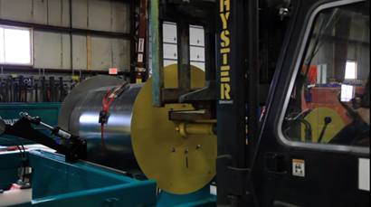
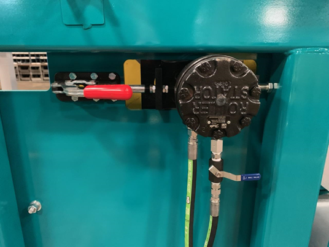

# Drop-Ins

TABLE OF CONTENTS

[1. INTRODUCTION 1]()

[2. DROP-IN UNCOILER INSTALLATION 2]()

[3. COIL INSTALLATION 3]()

[A. POSITION THE COIL 4]()

[B. Raise The Hold-Down Roll 5]()

[C. Remove the Drum Assembly from the Frame 5]()

[D. Remove side plate and hub assembly 6]()

[E. insert the Shaft Assembly 7]()

[F. Install the Side Plate and Hub Assembly 7]()

[G. Install the Collar Clamp 8]()

[H. Lift the assembly from the Coil Stand 9]()

[I. Lower the Assembly into the Frame 10]()

[J. Engage the drive motor 11]()

[K. Shaft Assembly InstallATiOn oVERVIEW 11]()

[4. COIL SELECT _\(Option\)_ 12]()

[5. WIRELESS PENDANT SYSTEM 13]()

[_6._ AUTO GRID FEED UP _\(Option\)_ 14]()

[A. Slack Bar 14]()

[7. HEAVY GAUGE OPERATION 14]()

[8. MAINTENANCE 15]()

**LIST OF FIGURES**

Figure 1. Hydraulic Drive Low Profile Uncoilers 1

Figure 2. EZ Load Hub Assembly 3

Figure 3. Drum Assembly - _expanded_ 3

Figure 4. Coil Resting on Coil Stand 4

Figure 5. Hold-Down Valve 5

Figure 6. Motor Disengaged 5

Figure 7. Lift the Drum Assembly 6

Figure 8. Collar Clamp 6

Figure 9. Drive Motor Engaged 11

Figure 10. Coil Select 12

Figure 11. Receiver Mounted on Frame Near Infeed Table 13

Figure 12. 6 Button Pendant in Docking Station 13

Figure 13. Pendant Mounted on Control Pedestal 13

Figure 14. Pinch Roll Switch 15

## INTRODUCTION

The Iowa Precision _Low Profile Uncoilers_ provide an economical means of staging and paying off material. The uncoilers are hydraulically powered. With the hydraulic drive system, a proportional valve is used to ensure smooth start and stop of the coil. _Slack Bars_ _\(see Figure 2\)_ located at the bottom of the uncoiler frame control the material loop. As the material is pulled from the loop, it is pulled off the _Slack Bar_, which activates the drive system to re-fill the loop.

Shaft Saddle \(Cradle\)

Drive Hub Side-plate  
\(Adjustable\)

Drive Hub Side-plate  
\(Fixed\)

Figure . Hydraulic Drive Low Profile Uncoilers

The basic setup requires that the material be jogged from the _Uncoiler_, up the _Powered Infeed Ramp_, past the feed table and into the pinch rolls on the processor.

With the optional _Grid-Auto Select_, the material is driven along the _Slack Bars_ into the drive rolls of the _Grid-Auto Select,_ up the _Powered Infeed Ramp_, past the feed table and into the pinch rolls.

## DROP-IN UNCOILER INSTALLATION

<table>
  <thead>
    <tr>
      <th style="text-align:left">
        <b>WARNING</b>
      </th>
    </tr>
  </thead>
  <tbody>
    <tr>
      <td style="text-align:left">
        
<em><b>Be careful</b></em><b> when lifting the unit to ensure that the control switches, and guards are not damaged.</b>
        

        
<b>Never rest the side plates directly on the floor.</b>
        

      </td>
    </tr>
    <tr>
      <td style="text-align:left"></td>
    </tr>
  </tbody>
</table>

1. Position the _Uncoiler_ behind the _Processor_ and bolt the _Uncoiler_ frame to the _Floor Channel Spacers_ of the _Powered Infeed Ramp_.

With the _Grid-Auto Select_ option attached to the _Uncoiler_ frame, bolt the _Grid-Auto Select_ to the _Floor Channel Spacers_ of the _Powered Infeed Ramp_.

One or more lengths of flexible conduit are provided with the equipment. Each of the lengths and each of the individual wires inside are labeled.

1. Connect the _flexible conduit_ to the specified electrical boxes.
2. Route the conduits in a path to prevent possible mechanical damage from foot traffic, forklift, production carts or other moving machinery.
3. Connect the wires inside the conduit to the corresponding terminals inside the boxes.

The hydraulic drive uncoilers require the hydraulic lines to be connected between the two frames and the processor.

## COIL INSTALLATION

Before any material can be processed, a coil must be loaded into the _Low Profile Drop-In Uncoiler_. Each _Uncoiler_ station includes a _Drum Assembly_. The shaft/drum assembly installs through the center of the coil. With the shaft assembly inserted, the _removable_ side plate installs over the shaft with the drum portion entering the center of the coil. When the coil is placed into the _Uncoiler_, the ends of the shaft rest in cradles located on each side of the _Uncoiler_ frame.

Slack Bars

Drum

Teardrops

Shaft

Drum

Hold-down roll

Side-plate  
\(adjustable\)

Drive Hub Side-plate  
\(fixed\)

Figure . EZ Load Hub Assembly

FORK TRUCK FORKS

SIDE PLATE

COIL

HUB

HUB & SHAFT  
WELDMENT

COIL STAND

COLLAR

Figure . Drum Assembly - _expanded_

| **DANGER** |
| :--- |
| **Extreme care is required whenever moving a coil of metal. Before a coil is loaded into the DROP-IN UNCOILER, it is the responsibility of the employer to provide training concerning safe material handling procedures to all employees involved in the process.** _**Failure to do so will result in severe injury or death.**_ |

| **DANGER** |
| :--- |
| **Before attempting to install a coil into a** _**Drop-In Uncoiler**_ **with any** _**system**_**, contact the material handling equipment manufacturer to verify that the equipment is of adequate capacity. Proceed with loading a coil** _**ONLY**_ **after all operators have completed a thorough review of safety procedures. Failure to do so WILL result in serious injury or death.** |
|  |
| _**Note**_ |
| _Material heavier than 20 gauge must be run from the first station closest to the processor._ |

### POSITION THE COIL

Set the coil on an IPI coil stand or like device. This places the coil 14" _\(35.56 cm\)_ from the floor.

| _**NOTICE**_ |
| :--- |
| Before continuing, it is important to identify the direction that the material will _uncoil_ when the coil is placed in the _Low Profile Drop-In Uncoiler_. |
|  |

The material in the LOW PROFILE DROP-IN UNCOILER _uncoils_ from the bottom of the coil as it is fed into the processor.

Figure . Coil Resting on Coil Stand

### Raise The Hold-Down Roll

Move the handle of the corresponding valve to the _**UP**_ position to raise the Hold-Down Roll.

Figure . Hold-Down Valve

### Remove the Drum Assembly from the Frame

<table>
  <thead>
    <tr>
      <th style="text-align:left">
        <ul>
          <li><b>WARNING</b>
          </li>
        </ul>
      </th>
    </tr>
  </thead>
  <tbody>
    <tr>
      <td style="text-align:left"><b>The uncoiler drive motor must be moved aside before shaft removal to prevent motor damage.</b>
      </td>
    </tr>
    <tr>
      <td style="text-align:left"></td>
    </tr>
  </tbody>
</table>

1. Move the red handle to the far left AWAY from the motor to disengage the gears. This positions it for removal of the shaft assembly. See _Figure 6_.

Figure . Motor Disengaged

| _**Note**_ |
| :--- |
| _The Shaft assembly can be removed with the fork truck from either side of the frame, but_ _**it is easier to install the coil when the shaft is removed from the drive side.**_ |
|  |

| **CAUTION** |
| :--- |
| Coils are positioned into a _Low Profile Drop-In Uncoiler_ station with safe _coil handling system_. |
|  |

1. Use a fork truck or crane to lift the shaft assembly from the uncoiler frame.

Figure . Lift the Drum Assembly

### Remove side plate and hub assembly

Loosen the bolts on the uncoiler collar clamp and remove the clamp and remove the side plate and hub assembly from the shaft.

 

SPREADS

TIGHTENS

Figure . Collar Clamp

| _**Note**_ |
| :--- |
| _It is important to insert the_ _**driven side shaft assembly**_ _through the correct side of the coil in order for the material to uncoil properly._ |
|  |

### insert the Shaft Assembly

1. Insert the Shaft Assembly into the Coil.

1. Shaft Assembly Fully Inserted into the Coil.

### Install the Side Plate and Hub Assembly

1. Install the side plate and hub assembly onto the shaft.

1. Push the plate until the hub is in the coil and the side plate is flush with the edge of the coil.

### Install the Collar Clamp

1. Slide the collar clamp onto the shaft.

1. Push the collar in until it is flush with the side plate. Be sure the notch on the collar is aligned for proper installation.

1. Tighten the collar on the shaft. Be sure the spreader \(middle\) bolt is out of the way so it does not interfere with tightening the collar.

### Lift the assembly from the Coil Stand

1. Insert the forks into the drum assembly.

1. Lift the loaded drum assembly from the coil stand.

### Lower the Assembly into the Frame

| **CAUTION** |
| :--- |
| Prior to installing the drop-in uncoiler _shaft assembly_, ensure the hydraulic _hold-down roll_ is raised completely and the _motor_ is moved aside. _See Figure 6_. |
|  |

1. Carefully lower the loaded drum assembly into the _Uncoiler_ frame.

1. Be sure the shaft ends are aligned with the bearing blocks as the assembly is lowered.

### Engage the drive motor

Move the red handle to the FAR right toward the motor to engage the _Uncoiler_ drive motor.

Figure . Drive Motor Engaged

| **DANGER** |
| :--- |
| **Contact the** _**material handling equipment**_ **manufacturer to verify that the forklift truck capacity is adequate for the application. Failure to use equipment of the appropriate capacity WILL result in serious injury or death.** |
|  |

### Shaft Assembly InstallATiOn oVERVIEW

**Position and Align**

1. Lift the coil into position over the _Uncoiler_ and lower the coil into the saddles on the _Uncoiler_.
2. Apply power to the system and turn on the hydraulics.
3. Move the motor into the operating position. See _Figure 9_.
4. As the motor is engaged the small and larger drive gear teeth _should_ self-align.
5. If the teeth of the two gears DO NOT align, tap the _Uncoiler JOG FWD_ or _REV_ on the _remote pendantt_ to rotate the gear of the hydraulic drive motor as the coil is engaged.

## COIL SELECT _\(Option\)_

A powered feed-up roll assembly is located between the first station of the uncoilers and the processor. These rolls are used to drive the material from the uncoilers, up the feed-up chute and into the processor. This assembly may contain one set of drive rolls or multiple sets, depending upon the model purchased.

**E**

**D**

**C**

**B**

**A**

Figure . Coil Select

| **A** | Electric Drive Motor |
| :--- | :--- |
| **B** | Upper & Lower Drive Rolls |
| **C** | Station Shutoff |
| **D** | Pneumatic Regulator & Gauge |
| **E** | Pneumatic Lockout Valve |
|  |  |

With the material properly threaded between the drive rolls:

1. Open the desired station shutoff \(item C, _Figure 10_\).

* Station shutoff \#1 \(coil \#1\) is at the top. The last shutoff is diagonally down to the left.

1. Press _the Coil Select Jog_ on the _remote pendant_. The selected feed rolls will lower and drive the material up the feed chute into the feed table area. The material is then driven up the feed-up chute and into the first set of pinch rolls of the processor.

Located on the operator side of the Coil Select, is a regulator and gauge. This regulator controls the amount of pressured used to _raise_ the rolls. System pressure is used to lower the drive rolls for feeding purposes. This pressure should be set just high enough to raise the rolls off the material.

| _**Note**_ |
| :--- |
| _To reduce edge wave on narrow coils, increase the UP pressure, which will reduce the amount of down pressure during the feeding process._ |

## WIRELESS PENDANT SYSTEM

The wireless pendant system consists of two transmitter handsets \(one as a backup\) and receiver unit. The system automatically searches for, and locks onto a free and uninterrupted channel at every system startup, or during operation if radio interference is encountered. The pushbutton contacts have a defined snap-action that provides tactile feedback even through gloves. The remote requires two AA batteries for more than 100 hours of uninterrupted operation between replacements.

See MAGETEK _Flex 6EX2 System Radio Control Equipment Instruction Manual prior to operation._

| **CAUTION** |
| :--- |
| At the start of each work shift, or when a new operator takes control, operators should do the following steps as a minimum. |
|  |

* **PRE-OPERATION TEST**
* Test all warning devices.
* Test all direction and speed controls.
* Test the transmitter emergency stop.

|  |  |  |
| :--- | :--- | :--- |
| Figure . Receiver Mounted on Frame Near Infeed Table | Figure . 6 Button Pendant in Docking Station | Figure . Pendant Mounted on Control Pedestal |

## AUTO GRID FEED UP _\(Option\)_

To enable hands free loading of coils into the processor, the Auto Grid Feed stages each coil between the uncoilers and the processor. The operator then selects which coil is to be processed and the leading edge is jogged into the processor without handling the coil. Each station is equipped with a powered hold down roll to assist in feeding and rewinding coils.

Heavy gauge material \(14 or 16ga.\) coils are feed from the first station nearest the processor and are loaded with the leading edge being feed over the top.

### Slack Bar

Coils are loaded so the material _uncoils_ off the bottom of the coil, not from the top \(_see the preceding description on installing the shaft_\). The material lays over sets of slack bars, which are located below the coil. The material is then threaded through the threading rolls or directly into the feed table.

| _**Note**_ |
| :--- |
| _Material heavier than 20 gauge must be run from the first station closest to the processor._ |
|  |

During operation, a _selected_ station uncoils material whenever the processor lifts \(_pulls_\) the material off the slack bars. When the coil material is in contact with the _insulated_ slack bars, a _low voltage_ control circuit is completed which _disables_ the drive motor. As the material is lifted off the slack bars, the control circuit _enables_ the drive motor. Control of the material feed to the processor depends on whether or not the material for the _selected_ station is in contact with the slack bars.

| _**Note**_ |
| :--- |
| _The material feed system used to control a LOW PROFILE DROP-IN UNCOILER unit requires that the coil material be a conductor of electricity. To ensure that the feed system functions properly the slack bars need to be cleaned on a regular basis._ |
|  |

## HEAVY GAUGE OPERATION

Below is the recommended setup procedure for processing 16–14 gauge materials when the machine has the _Power Hold-Down Roll_ option:

1. Load the coil so the leading edge of the material pays off the top \(waterfall\).
2. Lower the _Power Hold-Down Roll_ onto the coil.
3. Ensure proper eye and hand protection is donned.
4. Carefully cut and remove the band\(s\).
5. Use the pendant to jog the material onto the feed table, _**bypassing**_ the coil select.
6. Turn the _PINCH ROLL_ switch to the UP position \(raise\). See _Figure 14._
7. Use the pendant to jog the leading edge of the coil just past the _pinch roll_.
8. Turn the _PINCH ROLL_ switch to the DOWN position \(lower\)
9. Jog the material until the leading edge is 12–24 inches into the feed and straightener rolls.
10. Turn the _PINCH ROLL_ switch to the UP position \(raise\).

**UP DOWN**

**PINCH ROLL**

Figure . Pinch Roll Switch

| _**NOTICE**_ |
| :--- |
| This switch is used to raise and lower the Processor entry _Pinch Roll_. The hydraulics must be on to utilize this switch. |
|  |

## MAINTENANCE

For exact information on your systems, always refer to the assembly and schematic drawings.

<table>
  <thead>
    <tr>
      <th style="text-align:left">
        <ul>
          <li><b>WARNING</b>
          </li>
        </ul>
      </th>
    </tr>
  </thead>
  <tbody>
    <tr>
      <td style="text-align:left"><b>Maintenance should be performed ONLY by qualified individuals who are familiar with the function, operation and hazards associated with the equipment. Uninformed actions could cause equipment damage and/or personal injury.</b>
      </td>
    </tr>
    <tr>
      <td style="text-align:left"></td>
    </tr>
  </tbody>
</table>

* Check for loose or worn parts at least weekly.
* Repair all oil leaks when they are first noticed.
* Follow the recommended lubrication schedule in the Maintenance Section.
* Analyze or replace the hydraulic oil annually.
* The oil temperature is not to exceed 160 degrees F.
* Replace the oil filter after 30 days of operation and every 6 months thereafter.
* When replacing or adding oil and lubricating the unit, use the recommended listings on the oil and lubricating chart included in the Maintenance Section of this manual.
* When troubleshooting a problem, always refer to the electrical and hydraulic schematics. Have both schematics close by when contacting the manufacturer for help in solving a problem or when ordering replacement parts.

For help contact the Mestek Machinery Customer Service Department.

### Lubrication

| Table . Lubrication Points and Frequency |  |  |  |
| :--- | :--- | :--- | :--- |
| **LOCATION** | **LUBE TYPE** | **UNCOILER SYSTEM** | **FREQUENCY** |
| Hold Down Roll Assembly | B | Bearings, Bushings, Friction Points | Monthly |
| Hydraulic Fluid Filler Cap | Clean with solvent, blow dry | Filler Screen | Semi-Annual |
| Hydraulic Fluid Return Filter | Replace | Hydraulic System | Semi-Annual |
| Hydraulic Fluid | E - Fluid Replace | Hydraulic System | Semi-Annual |
| Dancer Arm Bearing | B | Dancer Arm | Monthly |
| Cylinder Drive Chain | A | Rotating Cylinder | Monthly |

| _**Note**_ |
| :--- |
| _**Check weekly for loose or worn parts. Check the chain tension and sprocket alignment on a quarterly basis.**_ |
|  |

